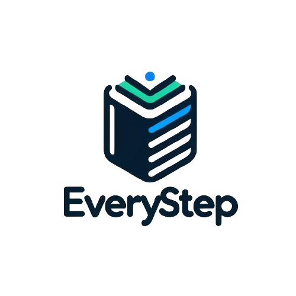
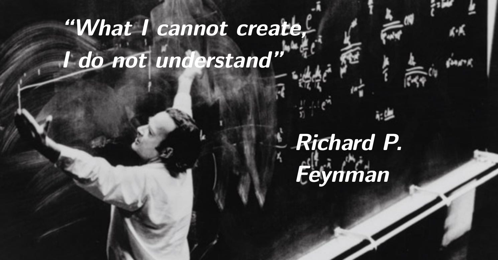

# everystep

<div align="center">
  <a href="https://github.com/weijiew/everystep">
    
  </a>


[](https://everystep.dev)


  

</div>

该项目最初为写名校 lab 过程中留下了的记录，但是因为[学术诚信](http://integrity.mit.edu/)的缘故，公开解决方案甚至代码是不合适的。但是直接删了有点可惜，后来想尝试换一门语言重写 lab/proj/hw 等内容，所以逐渐演化为用其他语言重写，造轮子过程中的笔记。例如从零实现 OS/Compiler/DB/ld 等，此外和课程答案相关的内容确实会逐渐删去。

## 🐲 从零实现模拟器(TODO)

1. 使用 C++23 从零实现 RISC-V 模拟器
2. 使用 C++23 从零实现 RISC-V 模拟器（1）：最简 CPU
3. 使用 C++23 从零实现 RISC-V 模拟器（2）：内存和总线
4. 使用 C++23 从零实现 RISC-V 模拟器（3）：指令解析

## 🍼 从零实现 RPC

## 😈 从零实现 WebServer

## 🐹 从零实现编译器(TODO)

## 🐷 从零实现 OS (TODO)

## 🚀 从零实现数据库(TODO)

## 本地运行

```
git clone https://github.com/weijiew/everystep.git
cd everystep && pnpm install && pnpm run dev
```

## 贡献

欢迎任何意义上能够优化项目的贡献。

## Star 历史

[](https://star-history.com/#weijiew/everystep&Date)

## 协议

主题参考自：[vitepress-nav-template (MIT License)](https://github.com/maomao1996/vitepress-nav-template)

本仓库的主题是 MIT License，文字内容版权均为 CC BY-NC-SA 4.0 International License. 引用的话注明出处。

2019 - 2023 [©weijiew](https://github.com/weijiew/). Released under the CC BY-NC-SA 4.0 International License.
