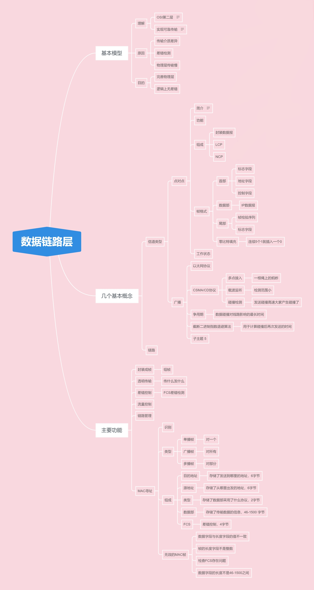

# 概述

## 作用
- 协议比较多，物理层搞不定。
- 物理层无法鉴别信息是否存在差错。
- 物理层以比特为单位传输速率，效率低下。

## 概念
点对点
广播信道
链路:从一个点到相邻的点，中间没有其他的交换节点。
链路又分为物理链路和逻辑链路，逻辑链路又称为数据链路。

## 三个功能
封装成帧
透明传输
差错检测

# 三个基本问题

## 封装成帧

什么是**帧**？
[wiki的解释](https://zh.wikipedia.org/wiki/%E5%B8%A7)
简而言之，此处的帧就是数据传输单元或者是数据包。
帧又分为控制部分和数据部分。封装成帧就是在数据部分的基础上加上控制部分。
控制部分又分为首部和尾部。首部和尾部二者实现了帧定界。
帧 = 首部（SOH） + 数据部 + 尾部（EOT）
数据部分有上限 ：数据部分应 <= MTU。

## 透明传输

简而言之，所谓透明传输就是发送什么我就接受什么，中间没有出现差错。
而帧可以分为数据部分和控制部分，二者都是字符构成。但是如果控制部分出现在了数据部分时该如何处理？
这是透明传输需要解决的问题。例如以下这个问题：在实际处理过程中，当区分一个帧时，如果帧的数据部分出现 EOT 字符会被解析为结束字符而处理掉，使得数据部被切分。无法正确的处理帧。
针对以上情况可以使用字节填充法来处理。类似于 c 语言输出时的转义字符。

### 字节填充法
针对出现的控制字符的位置插入转移字符 ESC ，
使得这一部分不会被当作 SOH/EOT 处理，而是当作数据部分正常处理。
而如果出现相同的 ESC 时，那就在 ESC 前面再加 ESC，直到可以正确识别为止。

## 差错控制

### 是什么？

在传输中出现了比特差错。
例如：在传输过程中会将 0 误传成 1 ， 或者将 1 误传成 0 。
误码率（BER）：错误比特 / 全部比特 
为了保证可靠性，引入了差错检测的功能。
差错检测码又分为纠错码和检错码。

### 循环冗余检验 CRC

在数据部分后面加上一些数据，比对加上的数据来判断是否出现差错。

# 点对点协议 （PPP）

# 局域网

## 简介
* 一个单位，地理范围和站点数目均有限。
* 优点
  * 具备广播功能，可以方便的访问全网。
  * 便于系统的扩展和逐渐演变，各个设备灵活可调整。
  * 提高了系统的可靠性，可用性和生存性。
## 拓扑结构
有三种拓扑结构
* 星形网
* 总线网
* 环形网
## 信道共享技术
分为两种:
* 静态划分信道
  * 频分复用
  * 时分复用
  * 波分复用
  * 码分复用
* 动态媒体接入控制简称多点接入
  * 也就是信道并非在用户通信时固定分配给用户的。
  * 随机接入
    * 所有用户可以随机发送信息，而多个用户发送的信息在同一时间内可能会产生碰撞。
  * 受控接入
    * 用户布可以随机发送，受控。

## 轮询系统

将局域网内的机器分为主站和次站，主站依次询问每一个次站是否需要发送信息。

## 令牌环
在环形网中，A 站如果想要向 D 站发送信息的话
* 先捕获空令牌。
* A 站在空令牌中填充想要发送的信息。
* 令牌经过 B，C 站时分别转发。
* 令牌到达 D 站，发现里面有自己的信息就将令牌中的数据帧复制下来，令牌依旧原封不动的转发。
* A 收到数据帧，还原出空令牌。

## 以太网标准
* DIX Ethernet V2
* IEEE 的 802.3 标准

## 数据链路层的子层
* 逻辑链路控制
* 媒体接入控制

## 网卡
通信适配器，网络接口卡。

### 功能
* 数据传输进来的是串行，需要经过网卡转化为并行，反之也是
* 数据缓存
* 以太网协议

# CSMA/CD

* CSMA: 载波监听多点接入
* CD: 碰撞检测
* 总线型以太网数据收发采用的协议

## 为什么要采用 CSMA/CD 协议
以太网数据采用广播的方式来收发数据，但是数据会发送碰撞，碰撞后会导致参与者的数据无效。

所以需要采用 CSMA/CD 协议对数据的发送进行控制。

## CSMA/CD 协议是什么？
* 多点接入：计算机以多点接入的方式连接在一根总线上，也就是一根绳上的蚂蚱，而蚂蚱是计算机。

* 载波监听：为了避免数据间发生碰撞，会设置一个监视器，判断总线上是否有正在发送数据的计算机，如果有就停止发送，避免发送碰撞。

* 碰撞检测：有了载波监听，为什么还要设置碰撞检测？
  * 有两个原因，第一个原因是载波监听检测的范围比较小，只能检测“家门口”附近的计算机，而不能检测整个总线。
  * 另一个原因是传播时延的存在，可能检测是时候没问题，检测完毕开始发送，发送之时别的计算机也开始发送数据，也就是二者无法同步导致数据碰撞产生了。
  * 所以引入的碰撞检测，一旦数据间发送碰撞会导致总线上的信号电压变化，而变化的电压会使得计算机产生两种操作:
    * 一是立马停止发送数据，因为数据碰撞导致参与碰撞的帧变成无效帧，而帧是一个整体所以后续的数据也就没必要发送了。
    * 二是发送若干比特的人为干扰信号，使得参与碰撞的所有用户知晓发送碰撞了。

## 注意

* CSMA/CD 协议不能进行全双工通信而只能进行双向交替通信，也就是半双工通信。
* 每个站在发送数据后的一小段时间内，存在着遭遇碰撞的可能。
* 发送不确定性使得整个以太网的平均通信量远小于以太网的最高数据率。

## 争用期
数据帧发送后至多经过 2t 的时间就可以知道数据帧是否遭受碰撞。

2t 是经过 t 时间下， A 发送的数据到达了 B 的家门口，在家门口发送的碰撞，然后返回，一来一回时间就是 2t 。

而 2t 这段时间就是争用期，也称碰撞窗口。经过这段时间还没有检测到碰撞，才可以肯定这次发送不会产生碰撞，因为 2t 是碰撞发送的最大值。

## 截断二进制指数退避算法
数据产生碰撞后什么时候再次发送合适？截断二进制指数退避算法就是为了解决这个问题。
* 确定基本的退避时间，以 2t 为单位。
* 设置重传次数 k , k <= 10 , 即 k = Min[重传次数 ， 10] 
* k 确定后， 在从 [0,1,2,...,(2^k - 1)] 中**随机**取一个数记为 r ， 而重传所需的时间就是 r 倍的基本退避时间。
* 当重传次数达到 16 次还不成功时就丢弃该帧，向高层报告。

### 作用

* 减小重传的时再次发生碰撞的概率。
* 维护系统的稳定。如果冲突较多时，这个方法会使得平均时间随次数的增多而增多，也称动态退避。

## 以太网的一些指标
- 争用期的长度： 51.2 微秒
针对 10 Mbit/s 的以太网来说，51.2 微妙可以发送 64 字节，也就是 512 比特

- 最短有效帧长： 64 字节
如果发送碰撞一定在 51.2 微妙内，而这一段时间最多发送 64 字节。

- 帧间最小间隔： 9.6 微秒
检测到总站空闲后还需等待 9.6 微妙，这样可以使得接收方准备好。

## 总结

* 适配器从网络层中拿到一个分组，加上首部尾部封装成帧。放入适配器的缓存中，准备发送。
* 适配器检测信道是否空闲，并在 96 比特时间内信道保持空闲，就发送此帧，反之就继续检测等待信道空闲再发送。
* 发送后如果检测到碰撞就停止发送，并发送人为的干扰信号。
* 产生碰撞，发送终止后执行指数退避算法，等待 r 倍的 2t 时间后继续检测信道。

# MAC 层
MAC 地址，也叫硬件地址，物理地址，适配器地址，适配器标识符 EUI-48。可以唯一标识一台计算机，等同于我们的身份证。

MAC 地址共 48位（6个字节） ，前 24（三个字节） 位由 IEEE 注册管理机构制定。后 24（3个字节） 位由厂家制定。

## 识别

首先适配器收到 MAC 帧后先采用硬件检查帧中的 MAC 地址，如果是发送给本站的话就收下，反之丢弃。

## 三种帧
发送给本站的帧有三种类型，分别是：
* 单播帧
* 广播帧
* 多播帧

## MAC 帧组成

MAC 帧由 **目的地址** + **源地址** + **类型** + **数据** + **FCS** 组成。

**目的地址** 和 **源地址** 大小：都是六个字节。作用：也就是 MAC 地址，记录发出和接受者的位置。

**类型** 大小:字段共两个字节。 作用：用来标记上一层用的什么协议。方便把收到的 MAC 帧的数据交给上一层的这个协议。

**数据字段** 大小：数据部 46 - 1500 字节，（46怎么来的？46 = 64（MAC 客户数据字段最小长度） - 6（目的地址） - 6（源地址） - 2（类型） - 4（FCS）） 作用： 传输数据。

**FCS** 此字段共 4 字节。作用：降低误码率，从 $1×10^-8$ 降低到 $1×10^-8$

除此之外，在 MAC 帧的前面还有 7 个字节的前同步码和一个字节的帧定界符，表示后面是 MAC 帧。

## 无效的 MAC 帧

如果 MAC 帧出现以下的情况就会将这个帧丢弃，以太网不负责重传丢弃的帧。

* 数据字段的长度与长度字段的值不一致。
* 帧的长度不是整数字节。
* FCS 差错检测出问题。
* 数据字段不再 46 - 1500 字节之间。

# 扩展的以太网

可以从两个方向来扩展，从物理层扩展和数据链路层扩展。

## 物理层扩展
* 使用光纤和一对光纤调制解调器连接到集线器上。
* 使用多个集线器扩展，形成星形结构的以太网。
优点：扩大了碰撞域和以太网的覆盖面积。
缺点：吞吐量并未增大。如果不同碰撞域的数据率不同就不能合并。

## 数据链路层扩展
* 使用网桥
* 以太网交换机
  * 交换式集线器

# 总结

