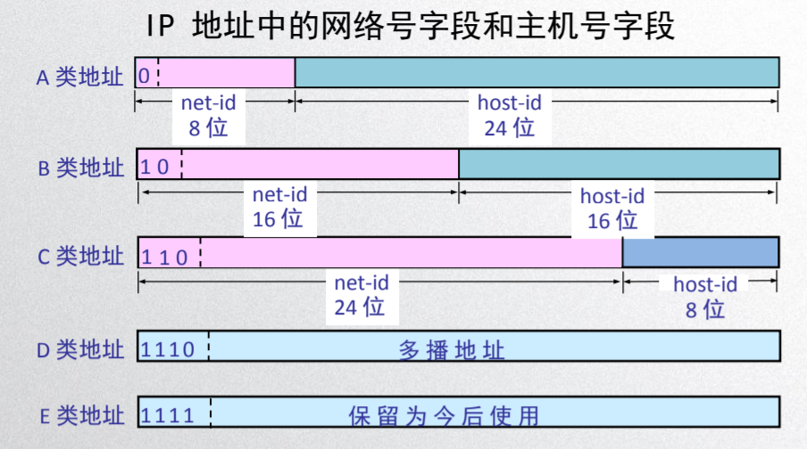
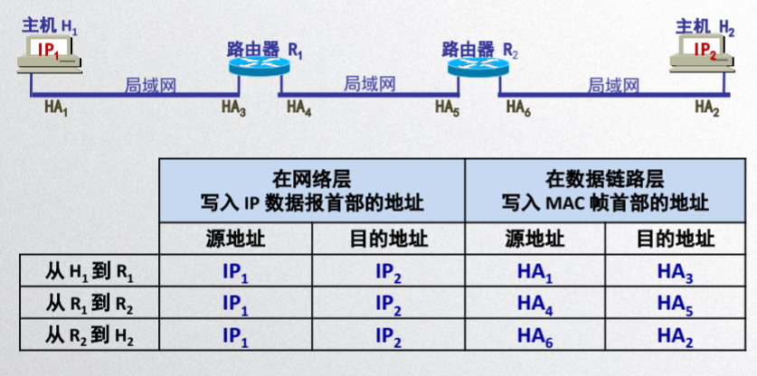
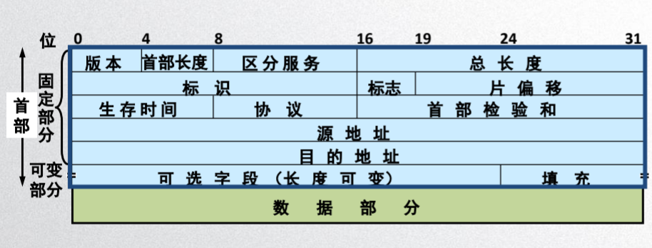

# 网络层

网络侧只负责尽力转发数据包，不保证质量，丢失就重传。

# 网络层的两种服务
虚电路服务，数据报服务。

这些服务都是向上给运输层提供的服务。

服务的目的是为了实现可靠的交付。但是由网络还是端系统来负责存在争议。

## 虚电路服务
* 面向连接的通信
* 建立虚电路，也就是逻辑上的电路，并不是真正物理上的连接，保证通信所需的资源。
* 不要填写目的地址，只需要虚电路的编号。
* 加上可靠传输的网络协议可以使实现无差错传输。

## 数据报服务
* 因特网的设计思路
* 网路层向上只提供数据报的交付服务，尽最大努力的提交。
* 发送分组时不需要建立连接，每个分组独立发送，与其前后分组无关。
* 网路层不提供服务质量承诺，所以传送容易出错。
* 路由器可以设计简单价格低廉。因为不提供端到端的**可靠**服务。
* 关于差错的控制交给运输层来负责。
* 网络的造价降低，运行灵活，适合多种应用。

## 两种服务的区别
* 虚电路服务的网络层保证服务质量，而数据报服务则将其交给运输层来保证。
* 虚电路服务需要建立连接，而数据报服务不需要。
* 进行分组时，虚电路服务按顺序到达，数据包服务不一定按顺序。
* 终点的地址在建立连接时使用，而数据报服务的每个分组都有完整的地址。
* 分组与分组，如果在同一条虚电路上就按同一路进行转发，数据报服务中的分组则是独立的自己选择路由转发。
* 如果某个节点出现故障，那么这个节点上的虚电路都不能工作，而数据报可能会在这个节点上丢失一些分组。
* 差错控制和流量控制虚电路服务中则是由网络负责或用户主机负责，数据报服务则是由用户主机负责，网络层不负责。

# IP 地址

IP 地址可以标识一台主机，一共 32 位，不同地域下不同。

关于 IP 地址的发展划分为三阶段： 分类的IP地址，子网的划分，构成超网。

## 分类 ip
ip 地址由网络号和主机号组成。
* 网络号 net-id 标志这个主机所连接到的网络。
* 主机号 host-id 标志着该主机或路由。
  
ip 地址分为五类， A / B / C / D / E

32 位的二进制 IP 地址每八位分割开来，形成了 4 段，每一段在转成十进制就是我们现在经常看到的。

## IP 地址的特点

* IP 地址的网络号由管理机构分配，剩下的主机号则有单位自行分配。
* 路由器只根据网络号去转发分组降低了路由表中的项目数。减小了存储空间。

# IP 地址和硬件地址

IP 称为逻辑地址，硬件地址也就是MAC地址，也就是物理地址。

ip 地址放在数据IP数据报的首部，而 MAC 地址放在 MAC帧的尾部。

IP 地址就像送快递一样，拿到目的第在中间的路由器中不断的转运。

网络层之的地址是 IP 之下是 MAC。从虚拟的 IP 层面来看可以看成 IP 数据报的流动。

IP 层封装了底层复杂的细节，抽象起来再网络侧讨论主机与主机间的通信。

流程如下：

# ARP协议
ARP 协议是用来解析ip地址和硬件地址的。其内部有一个高速缓存，这个缓存将ip 地址和物理地址进行了映射。随着时间的变化映射还会失效。并且这个解析是自动的，主机的用户感受不到。

当主机 A 像向主机 B 发送 ip 数据报时的步骤

* A 首先在 ARP 的高速缓存中查找 B 的ip地址对应的硬件地址，再将硬件地址写入 MAC 帧中。然后通过局域网发送。
* 如果没有查找到，就以广播的方式发送 ARP 请求，主机 B 收到 ARP 请求后 发送响应，将自己的 ip 地址和硬件地址的映射写入 ARP 高速缓存中。

说白了 ARP 协议就是去找物理地址的。

# IP 数据报的首部格式

数据报 = 首部 + 数据部

首部 = 固定部分 + 可变部分

固定部分 = 20 字节

首部组成：

# IP 层转发分组的流程

# ICMP 协议

* 用来测试网络层是否故障。 命令 ping 的实现，比较常用。

局域网的延迟应该小于 10 ms 。

TTL： 数据包最多经过 64 个路由器，每经过一个就减一。可以用来初略的判断对方的系统，不同的系统初值不同，分别是：linux 64 windows 128 Unix 255 

# IGMP
* 点到点
* 广播
* 多播