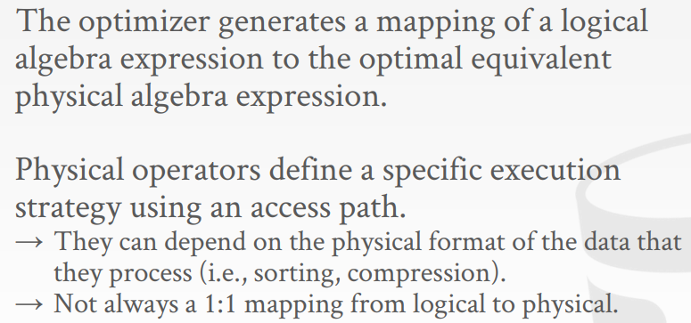
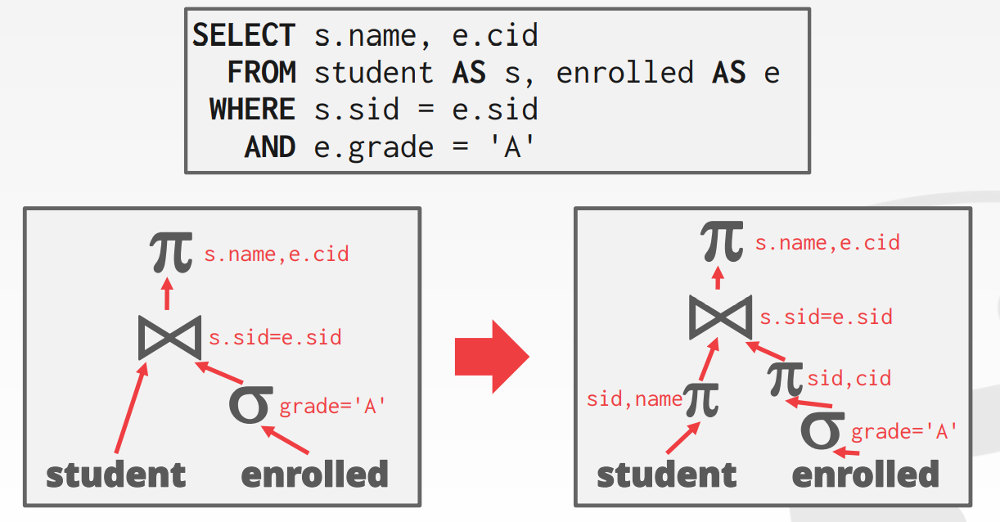

> 参考：
> 视频讲解：https://www.bilibili.com/video/BV1bQ4y1Y7iT/?spm_id_from=333.788
> ppt：https://15445.courses.cs.cmu.edu/fall2021/schedule.html

# Lecture #01: Course Introduction and the Relational Model

数据库是相关联数据的集合，对真实世界的建模。

数据库是核心组件。

没有数据库之前通常是用文件来存储数据。

如果想查询某些数据需要逐行遍历文件进行筛选：

但是由此产生的一堆问题，例如：

如何实现两张表之间的映射？如果乱改某些字段该怎么办？如果一个 album 中有多个歌手该怎么办？

如何查找特定的记录？两个应用如何使用同一个数据库？两个线程同时写同一个文件？

数据写到一半数据库崩了怎么办？

# Lecture #14: Query Planning & Optimization I

## QUERY OPTIMIZATION

因为 declarative language 的缘故，查询的具体过程是由 DBMS 实现，而不同的过程开销不同，DBMS 需要选出性能最好的查询计划，进而引出了优化。

declarative language : 所谓声明式语言，我觉得可以简单的理解为完成一个任务，只看结果，至于怎么完成的都由系统的实现者来决定而非写代码的人要考虑的问题。SQL 就是一种生命式语言，SQL 告诉 DBMS 想要什么，而不是告诉 DBMS 怎么做。

目前出现了两个流派，第一个流派是声明式的语言，具体执行过程由 DBMS 来决定。第二个流派是人来写具体的执行过程。

优化一般有两种优化的思路：

1. 启发式的，重写查询，移除效率低的部分，不需要成本模型。
2. 估计每一个查询计划的开销，选择开销最小的查询计划。

一般来说以上两种手段都会采用。

如果两个关系代数产生的 tuple 集是相同的，那么可以认为二者是等价的。根据这个原理来实现优化。

大部分的 DBMS 都会重写查询计划而非原生的 SQL 语句。

一些具体的例子：

1. 谓词下推(Predicate Push-down)，提前过滤符合条件的 tuple 从而降低 join 时中间数据集的大小。
2. Projections Push down，
3. 表达式简化(Expression Simplification)，重写出来一个更简单的表达式。

## ARCHITECTURE OVERVIEW 查询流程总览 

1. SQL 查询。进行一些简单的预处理，处理一下字符串。
2. Parser 生成抽象语法树。
3. Binder 建立 AST 和数据库表名称之间的映射。
4. 生成初始的逻辑计划，重写 Tree 。
5. 优化：启发式，代价分析。
6. 生成物理计划。

## 逻辑查询计划和物理查询计划的区别

逻辑算子和物理算子之间的映射，但是二者并非一对一对应，一个逻辑计划可能对应三个具体的物理算子。

物理算子定义了具体的执行流程。

可以简单的将其理解为数据结构中的逻辑结构和物理结构。

优化是一个 NP-Hard 问题。

## 关系代数的等价性

如果两种查询得到同样的 tuple 集，那么可以认为这两种查询是等价的。

查询重写(query rewriting)：DBMS 可以不通过开销模型来得到更好的查询。

## 谓词下推 PREDICATE PUSHDOWN

下图是一个不做任何优化的查询例子。连接 student 和 enrolled 两个表查询成绩(grade)字段为 'A' 的学生 name 和 cid 。

一个简单的优化措施：可以提前过滤 enrolled 表，将 grade='A' 的行筛选出来再与 student 表连接。这样就降低了两个表连接后所产生中间数据的大小。

尽可能早的过滤。

重排 predicates 顺序。

简化复杂的 predicate 。

可以同样提前过滤 student 表，因为只用到了 sid，name 两列，而其他列都没有用到如果加载到内存中显然浪费。

## 更多例子

接下来是一些能够直接处理的优化，也就是在语法层面存在一些很直接的优化。

例如下面的语句显然不合理，所以并没有真正的去执行，而是直接处理返回结果。

除此之外还有更多的例子：

## 开销模型组成

1. 物理开销：CPU 执行，I/O，缓存命中等开销。
2. 逻辑开销：算子处理数据量的开销。
3. 算法开销：时间复杂度。

磁盘的开销是最大的。

# Lec15 并发控制理论

DBMS 的组件分为：

这一节主要研究基于代价的优化器。

根据代价模型估计多个计划的好坏从而选择一个最好的执行计划。

谓词的选择性近似为概率：

基于概率的思想来处理交集和全集：

# Join 结果集评估

此前是基于整个字段均匀分布，但是存在不独立的情况。

修改为桶内(区域字段)均匀分布，桶间不均匀。

采样，取子集分析子集推全集。

左深树，Join 的左子树也是 Join 生产的中间表，右子树必须是表。

## 

# lec15 事务

https://www.bilibili.com/video/BV1t3411v73Y/?spm_id_from=333.788

事务是一系列的操作，数据库操作的最基本单位。

如何实现事务？

一个简单的策略是复制事务执行前的数据，一旦事务执行失败就用之前的数据覆盖。缺点是没法并发。

事务之间的并发，存在一些问题，临时性的不一致（难以避免），永久性的不一致（不接受！）。

如何实现事务之间的并发？

为方便处理将数据库事务可以简化为对数据的读和写，将数据都简化为变量。

事务被 BEGIN 和 COMMIT/ABORT 包裹。其中 COMMIT 表示事务完成，ABORT 表示事务回滚，事务执行的结果只有这两种结局。

## ACID 

ACID 是事务正确执行的标准。

1. 原子性:要么都完成要么没开始，不存在中间态。
2. 一致性:应用系统从一个正确的状态到另一个正确的状态。而ACID就是说事务能够通过AID来保证这个C的过程。C是目的，AID都是手段。确保逻辑正确。一致性分为数据库一致性和事务一致性，此处是指数据库一致性。
3. 隔离性：事务之间是独立的。临时的修改别人看不到。
4. 持久性：写到磁盘上，永久保存。

## 原子性解决办法

原子性具体场景：

1. 刚取出一百块钱，DBMS 就崩了。
2. 刚取出一百块钱，断电了。

解决方法：

1. 写日志，将事务的每一步回滚到上一步的操作都记录到 undo log 中。除此之外日志可以提高I/O性能，先将一些 I/O 操作写到日志中，等待空闲的时候在根据日志去执行。日志还有一个作用是监控审计。
2. 只备份修改的页，增量备份。目前很少用，大部分都是用日志。

## 隔离性

方便程序员处理，不用考虑隔离，由 DBMS 自动实现。

为了实现隔离，出现了并发控制，有些任务不能并行，需要串行完成。如何实现串行？

## 三种冲突

当两个事务中的某个存在写操作时才存在冲突，如果全是读是不存在冲突的。冲突有三种：读写冲突，写读冲突，写写冲突。

1. 读写冲突：第一次读数据A和第二次读数据A结果不一样，破坏了隔离性。

2. 写读冲突(脏读)：T1事务更新数据A但没有提交，而此时T2事务对更新后的数据A进行操作。一旦T1事务撤销对数据A改变T2事务就会出问题。

3. 写写冲突：如下图，最终保存下来的数据是 T1 中的B，T2 中的 A 。

## 可串行化

之前提到的三种冲突是不能交换顺序的。除此之外可以交换顺序，而通过调整顺序可以实现串行化。如果通过调整发现存在冲突，无法改为串行那么就是不可串行化。

依赖图：一种判断是否可串行化的方法。

还是得看具体业务，虽然理论上不能串行，但是分析到具体业务，其实还是可以串行的。

目前所有的读写冲突都存在错杀的情况。

并发执行的最终效果需要和串行执行的最终结果一致。

# Lec 16 二阶段锁

## 锁的类型

latches 和 locks 。

先获取逻辑上的 lock 真正执行的时候再获取物理上的 latches 。

* S锁：共享锁（读锁）
* X锁：排他锁（写锁）

## 两阶段锁

## 死锁检测和预防

## 锁的层级

# 参考

1. [笔记1](https://zhenghe.gitbook.io/open-courses/cmu-15-445-645-database-systems/relational-data-model)
2. [笔记2](https://www.jianshu.com/nb/36265841)
3. [fall2019/schedule](https://15445.courses.cs.cmu.edu/fall2019/schedule.html)
4. [14-optimization1.pdf](https://15445.courses.cs.cmu.edu/fall2019/slides/14-optimization1.pdf)
5. [视频中文翻译](https://www.bilibili.com/video/BV1Cp4y1C7dv?p=14)
6. [一个好一点的视频中文翻译](https://www.zhihu.com/zvideo/1416347667424940032)
7. [13-查询优化-I [中文讲解] CMU-15445 数据库内核](https://www.bilibili.com/video/BV1qR4y1W7v6/?spm_id_from=333.788)