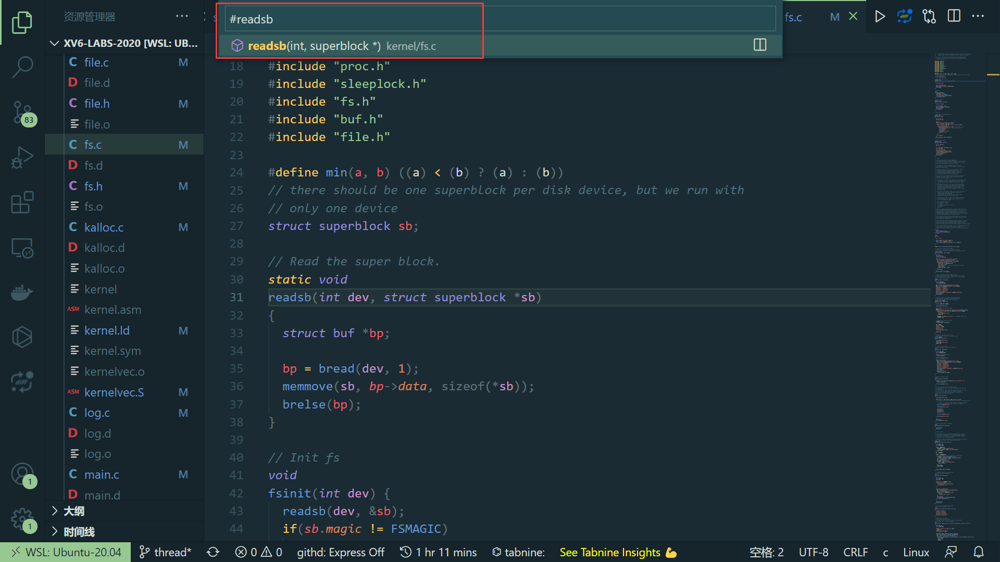

# 6.S081 Operation System 2020

schedule 页面：https://pdos.csail.mit.edu/6.828/2020/schedule.html

* [视频中文翻译](https://www.bilibili.com/video/BV19k4y1C7kA)
* [视频中文文字版](https://mit-public-courses-cn-translatio.gitbook.io/mit6-s081/)
* [lab 文档的中文翻译](https://github.com/duguosheng/6.S081-All-in-one)

## 一些技巧

* 全局搜索很方便，不用挨个翻文件查找。

VSCode 全局搜索快捷键 ctrl + p 加上 `# 加内容`。

* 如果出现 make grade 时出现 `/usr/bin/env: ‘python3\r’: No such file or directory` 

用 vim 打开测试文件输入如下内容：

:set  ff=unix 
:wq

* 如果想从头再来，可以回退到上一个版本重新开始(`git reset --hard HEAD^`) 。

或者删除分支，

## 参考

1. [MIT6.S081 Operating System Engineering 课程总结 & Lab 指北](https://blog.miigon.net/posts/s081-ending/)