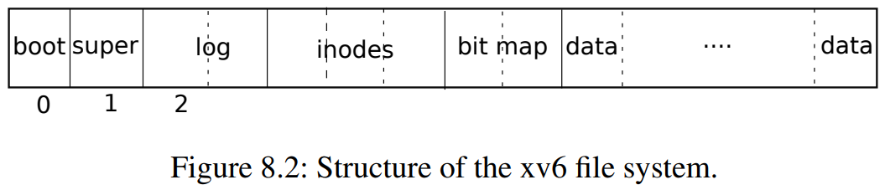

# Lab fs

首先切换分支：

    $ git fetch
    $ git checkout fs
    $ make clean

按照顺序看完下面的内容后再开始做实验，结合着代码来看，其实有很多重叠的内容，重点关注自己不理解的地方。

1. [lec13 视频](https://www.bilibili.com/video/BV19k4y1C7kA?p=13)
2. [lec13 视频文字版](https://mit-public-courses-cn-translatio.gitbook.io/mit6-s081/lec14-file-systems-frans) 
3. [lab 手册](http://xv6.dgs.zone/labs/requirements/lab9.html)
4. [xv6 book Chapter 8 File system](http://xv6.dgs.zone/tranlate_books/book-riscv-rev1/c8/s0.html) 

## 上述内容总结 

七层文件系统：

1. 磁盘层在 virtio 磁盘上读写块。
2. Buffer cache 缓存磁盘块并同步访问，确保一个块只能同时被内核中的一个进程访问。
   1. 同步访问磁盘块，以确保磁盘块在内存中只有一个 buffer 缓存，并且一次只有一个内核线程能使用该 buffer 缓存；
   2. 缓存常用块，以便不需要从慢速磁盘重新读取它们。
   3. bread 返回一个在内存中可以读取和修改的块副本 buf 。
   4. bwrite 将修改后的 buffer 写到磁盘上相应的块。内核线程在使用完一个 buffer 后，必须通过调用 brelse 释放它。buffer cache 为每个 buffer 都设有 sleep-lock，以确保每次只有一个线程使用 buffer（从而使用相应的磁盘块）。bread 返回的 buffer 会被锁定，而 brelse 释放锁。
   5. buffer cache 容量有限，用 LRU 来实现置换。
   6. buffer 缓存是一个由 buffer 组成的双端链表。由函数 binit 用静态数组 buf 初始化这个 链表， binit 在启动时由 main(kernel/main.c:27)调用。访问 buffer 缓存是通过链表，而不是 buf 数组。
   7. 
3. 日志层允许上层通过事务更新多个磁盘块，并确保在崩溃时，磁盘块是原子更新的（即全部更新或不更新）
4. 索引结点层提供单独的文件，每个文件表示为一个索引结点，其中包含唯一的索引号（i-number）和一些保存文件数据的块。
5. 目录层将每个目录实现为一种特殊的索引结点，其内容是一系列目录项，每个目录项包含一个文件名和索引号。
6. 路径名层提供了分层路径名，如/usr/rtm/xv6/fs.c，并通过递归查找来解析它们。
8. 文件描述符层用文件系统接口抽象了许多 Unix 资源（如管道、设备、文件等），使程序员的生产力得到大大的提高。

### XV6 站在文件系统的角度来看磁盘

首先需要考虑磁盘的组成，站在文件系统的角度来看，磁盘可以看成一个字节数组，由 block 组成。

在 xv6 中一个 block 是 1024 字节，其中又由 2 个 sector 组成，那么一个 sector 就是 512 字节。

从数组的角度来看，整个磁盘可看成由 block 组成的数组。 

1. block0 被称为 boot block 其中要么不使用，要么存储的是启动 OS 的代码，通过这些程序使得 OS 代码能够加载到内存中。
2. block1 被称为 super block 其中中存储的是一些元数据，例如文件系统大小，数据块数量，inode 的数量。通过mkdfs 将该块写入，然后通过该块建立起初始的文件系统。
3. block2-31 被称为 log block  中存储的是日志信息，用来做崩溃恢复之类的工作。
4. block32 到 45 中存储的是 inode。一个 inode 是 64 byte，而一个 block 是 1024 byte，所以每个 block 中存储了多个 inode。inode 用来表示一个文件的元数据，代表一个文件对象，所以一个 inode 就是一个文件。通过一个整数来唯一标识一个文件，而非文件名。
   1. 其中 type 字段表明inode是文件还是目录。
   2. nlink 字段，也就是link计数器，用来跟踪究竟有多少文件名指向了当前的inode。
   3. size字段，表明了文件数据有多少个字节。
   4. bn0 到 bn11，12 个指向 block 的指针，block 用来直接存数据。
   5. bn12 也是指向 block 但这是一个二级索引，指向的 block 中存其他 block 的地址。其中一个索引是 4 字节，所以一共指向了 256 个 block 。所以空间上限是 (12 + 256)*1024 。
   6. 如果用来表示目录，目录由 entry 组成。前两个字节表示 inode 序号，后 14 个字节表示文件名。
      1. 例如根目录(`/`)的 inode 在编号 1 中，也就是 block32 的 64B 到 128B 中。
      2. 如果查找其他目录，例如目录 `/y` ，从 inode1 的 bn0 中开始扫描，如果找到文件中会包含 inode 编号，然后读取相应编号查看相应的 block 。
      3. 如果查看 `/y/x` 则从存储 `/y` indoe 编号开始继续从 bn0 开始遍历，直到找到 `/y/x` 对应的 indoe 编号。
5. block45 中存储的是 bitmap ，只占据一个block，用来判断数据块是否空闲，0 表示空闲，1 反之。
6. block46 之后就都是数据块了。

通常 log，inode，bitmap 被称为元数据块。

### XV6 创建一个文件所经过的流程

分析 `echo “hi” > x` 执行流程：

1. 创建文件
   1. write 33 通过修改 inode 中的 type 字段表示将要被使用，这个字段同时也表示 inode 是文件还是目录。inode的type从空闲改成了文件，并写入磁盘表示这个inode已经被使用了
   2. write 33 实际写入 inode 的内容。inode 的内容会包含 linkcount 为 1 以及其他内容。
   3. write 46 向第一个 data block 写数据，这个 data block 属于根目录并且是根目录的第一个 block 。添加 x 的 entry 到根目录的 block 中。
   4. write 32 block 32 保存的仍然是inode。更新了根目录的大小，因为我们刚刚添加了 16 个字节的 entry 来代表文件 x 的信息。
   5. write 33 再次更新了文件 x 的 inode ，尽管还没有写入任何数据。
2. 将 "hi" 写入文件
   1. write 45 更新 bitmap 。通过扫描bitmap来找到一个还没有使用的data block将对应的bit设置为1。
   2. write 595 两次调用表明，文件系统挑选了data block 595。x 的 inode 中第一个direct block number是595。因为写入了两个字符，所以write 595被调用了两次。
   3. write 33 更新inode的size，direct block number(595)，字段。因为现在文件 x 中有了两个字符。
3. 将 "\n" 写入文件
   1. write 595
   2. write 33

## Large files(moderate)

增加xv6文件的最大大小。

通过 `bigfile` 来判断是否创建成功，下面是创建失败的情况。

    $ bigfile
    ..
    wrote 268 blocks
    bigfile: file is too small

bigfile 将会创建一个包含 65803 个块的文件，但未修改的 xv6 将文件限制为 268 个块。

为了支持 65803 个块，目前一共 12 + 1 ，12 是直接地址，1 是间接地址。将 1 指向的块在此拆分变成二级间接块，即 256*256。

12 中再拆出一个间接块就够了，即 `256*256+256+11 = 65803` 。

读懂 fs.c 中的 bmap() 。

ip->addrs[]的前11个元素应该是直接块；第12个应该是一个一级间接块（与当前的一样）；13号应该是你的新二级间接块。

1. 修改 NDIRECT
2. 修改 MAXFILE
3. 修改 dinode
4. 修改 inode
5. 需要重新生成 fs.img ，也就是先 make clean 再 make qemu 。
6. 修改 bmap (一级改成二级就行)
7. 修改 itrunc (同上)

没啥难的，照着改就成。

## Symbolic links(moderate)

支持软连接，也就是为文件创建一个新名称。符号链接不会增加文件的 inode 数。

成功时返回零。 出错时，返回-1，并适当地设置errno。

`symlink(char *target, char *path)` 例如 symlink("x/y","x/z"); 为文件 `x/y` 创建 `x/z` 的文件名。

整个流程就是为 path 创建 inode 。然后将其写入 target 中。

通过 sys_open 来创建文件， open 有两个参数，第一个参数是 path 表示文件的路径，第二个参数是 omode 表示权限，表示可读/可写/可执行。

sys_open 打开文件，需要处理递归遇到符号链接的情况。