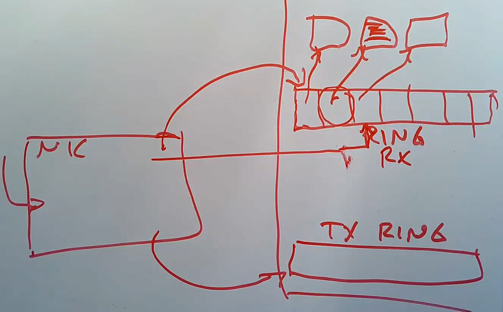
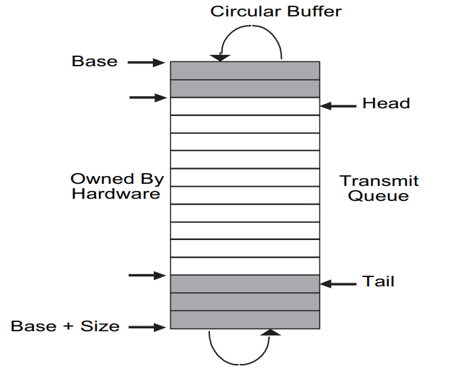

# Lab net

https://pdos.csail.mit.edu/6.S081/2020/labs/net.html

实现一个网络接口的驱动程序。

切换分支

    $ git fetch
    $ git checkout net
    $ make clean

## 总结

数据包到达后写入网卡，然后将数据包复制到内存中。

网卡需要知道将数据写到哪里。DMA 环是一个数据包缓冲区的指针数组，其中存储的是缓冲区的指针，通过该指针拿到真正存储数据的地址。RX 环和 DMA 环类似，只不过是用来发送数据的。

用 E1000 来处理网络通信，站在 xv6 的角度来看 E1000 是一个和真正以太网(LAN)相连的硬件。但实际上 E1000 和 LAN 都是由 qmeu 提供。在这个网络中 xv6 的 IP 地址是 10.0.2.15 。在这个 LAN 上还存在一个地址是 10.0.2.2 的 IP。当 XV6 使用 E1000 向 10.0.2.2 发数据时，qemu 将会复制将数据发送出去。

使用 qmeu 用户模式下的网络栈。 

`packets.pcap` 文件中记录了待发送和待接收的数据。通过命令 `tcpdump -XXnr packets.pcap` 可查看。

`kernel/e1000.c` 包含了 E1000 初始化代码以及两个待填充的空函数(transmitting,receiving)。

`kernel/e1000_dev.h` 包含了一些 E1000 寄存器和标志位的定义。

`kernel/net.c ` 和 `kernel/net.h ` 包含了一些简单网络协议的实现以及表示一个报文的数据结构(mbuf) 

`kernel/pci.c` 包含的代码用于 xv6 启动时搜索 PCI 总线上的 E1000 卡。

## Your Job (hard)

实现 `kernel/e1000.c` 中的发送数据(e1000_transimit)和接收数据(e1000_recv)的代码。并通过 `make grade` 。

头节点和尾节点可以结合着这张图来考虑。

### 实现 e1000_transmit

首先要明确的是 e1000_transmit 负责将输入的数据报塞入缓冲区中。

e1000_transimit 函数的输入是 mbuf ，mbuf 表示一个数据帧。内存中维护了一个环形队列(tx_ring),其中 E1000_TDH 作为队头指针，E1000_TDT 作为队尾指针。将 mbuf 塞入环形队列中。

1. 首先获取根据 E1000_TDT 获取到下一个可用位置的索引。
2. 根据索引拿到状态描述符(tx_desc)，检查 status 和 E1000_TXD_STAT_DD 判断该位置是否能用。
3. 判断当前缓冲区中之前遗留的数据是否已经被释放，如果没有就释放一下(mbuffree)。
4. 将输入的 mbuf 加入缓冲区中并更新状态。
5. tail 下标加一。

### 实现 e1000_recv

读取缓冲区中的数据

1. 进最大可能处理完所能处理的缓冲区，所以需要一个循环。
2. 获取下标，根据下标获取对应缓冲区的描述符并判断是否合法。
3. 更新状态并传递给上层网络栈(net_rx)。
4. 数据已经传走了，更新当前缓冲区。

