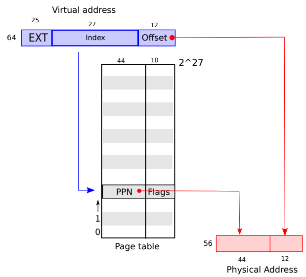

# Lab: page tables

[实验手册](https://pdos.csail.mit.edu/6.828/2020/labs/pgtbl.html) / [中文版](https://github.com/duguosheng/6.S081-All-in-one/blob/main/labs/requirements/lab3.md)

## 前置知识

阅读 xv6 书第三章。

`kern/memlayout.h` ，它捕捉了内存的布局。

`kern/vm.c` 它包含了大部分虚拟内存（VM）代码。

`kernel/kalloc.c` 它包含分配和释放物理内存的代码。

切换到 pgtbl 分支

  $ git checkout pgtbl
  $ make clean

## 1. Print a page table (easy)

源码被分成了多个文件，在 defs.h(kernel/defs.h) 中定义模块间的接口。

跟着 hint 走，看明白 freewalk 函数稍微改动即可。

`(pte & (PTE_R|PTE_W|PTE_X)) == 0` 表示非叶子节点。

commit: [PASS Lab3 Print a page table](https://github.com/weijiew/6.S081-2020/commit/6632a87f01b651984a54bd04f20cc63a99ca1b3f).

  $ make qemu-gdb
  pte printout: OK (6.9s)
      (Old xv6.out.pteprint failure log removed)
  == Test answers-pgtbl.txt == answers-pgtbl.txt: FAIL
      Cannot read answers-pgtbl.txt
  == Test count copyin ==

## 2. A kernel page table per process (hard)

Xv6 的每个进程都有自己的用户页表，但是共享同一个内核页表，而内核页表的地址是直接映射的。接下来的任务是修改内核，使每个进程都有自己独立的内核页表。共享的内核页表 `pagetable_t kernel_pagetable;` 位于 vm.c 中。

* pagetable_t 是什么？

pagetable_t 是一个指向 RISC-V 根页表页的指针。可以是内核页表，也可以是进程的页表。核心函数是 walk 和 mappages ，前者通过虚拟地址得到 PTE，后者将虚拟地址映射到物理地址。

pagetable_t 其实就是一个数组。接下来先研究 mappages 再研究 walk 。因为 mappages 调用了 walk 。

* mappages 函数的功能是将一个虚拟地址范围映射到物理地址范围。

结合着代码看，第二个参数 va 是开始创建 PTE 的虚拟地址，va 映射到了第四个参数 pa 指向的物理地址。映射成功返回零，如果通过 walk() 无法分配到所需页的页表就返回一。size 表示待虚拟地址的范围。

```cpp
int
mappages(pagetable_t pagetable, uint64 va, uint64 size, uint64 pa, int perm)
{
  uint64 a, last;
  pte_t *pte;

  a = PGROUNDDOWN(va); // 向下取整
  last = PGROUNDDOWN(va + size - 1);
  for(;;){
    if((pte = walk(pagetable, a, 1)) == 0)
      return -1;
    if(*pte & PTE_V)
      panic("remap");
    *pte = PA2PTE(pa) | perm | PTE_V;
    if(a == last)
      break;
    a += PGSIZE;
    pa += PGSIZE;
  }
  return 0;
}
```

通过 walk() 拿到 PTE ，根据 PTE 建立和物理地址 PA 的映射。 

PTE 是页表(pagetable_t)的一行数据，也就是页表是由 PTE 组成。其中 PTE 由 44 位的 PPN 和 10 位的 标志位(Flags)组成。44 位的 PPN 和虚拟地址的后 12 位(offset)共同拼接组成了物理地址。



PTE_V 存于 Flags 标志位中，表示 PTE 是否存在

`#define PA2PTE(pa) ((((uint64)pa) >> 12) << 10)`

其中 `PA2PTE` 表示将 PA 转化为 PTE ，右移 12 位表示剔除 offset (结合上图来看！上图也就是 xv6 Figure 3.1) 左移 10 位表示留出 Flags 位，后续通过按位或运算(|)将 Flags 拼接上来。

a == last 表示范围内的映射完了。`a += PGSIZE;` 表示步长是 PGSIZE，也就是 4096 bytes .

* 接下来研究 walk() 函数，结合图 Figure 3.2 来看，经过两次循环拿到最底层的页表，然后返回对应的 PTE 。最开始我不明白为啥用这么多页表，后来一想发现这其实就是一颗多叉树。顶层的页表步长最大，因为表里面套表。首先通过顶层的页表确定大致范围然后不断缩小范围，这样可以大大加快索引速度。

```cpp
pte_t *
walk(pagetable_t pagetable, uint64 va, int alloc)
{
  if(va >= MAXVA) // va 是虚拟地址
    panic("walk");

  for(int level = 2; level > 0; level--) { // 三级页表
    pte_t *pte = &pagetable[PX(level, va)];
    if(*pte & PTE_V) { // PTE_V 表示页表合法
      pagetable = (pagetable_t)PTE2PA(*pte);
    } else {
      if(!alloc || (pagetable = (pde_t*)kalloc()) == 0)
        return 0;
      memset(pagetable, 0, PGSIZE);
      *pte = PA2PTE(pagetable) | PTE_V;
    }
  }
  return &pagetable[PX(0, va)];
}
```

通过实验的要求是所有 usertests 运行正常。注意此时还没有改动代码，usertests 是可以正常运行的，将共享的内核页表改为独享的内核页表之后 usertests 依旧能正常运行才算通过实验。注意这个测试跑的很慢。

Some hints:

1. 在 struct proc 中增加一个字段，用于进程的内核页表。

> proc 是用于描述进程的结构体，其中包含了进程的所有状态信息。

在 proc 结构体中 (kernel/proc.h) 添加内核页表，表示进程独占的内核页表。每个进程的内核页表应该与现有的全局内核页表相同。

```cpp
pagetable_t kernelpgtbl;     // Kernel page table
```

2. 为一个新进程生成内核页表的合理方法是实现一个修改版的 kvminit，它可以生成一个新的页表而不是修改 kernel_pagetable 。你想从 allocproc 中调用这个函数。

> 阅读 kvminit，kvminit 是什么？ xv6 3.3 Code: creating an address space

修改 kvminit ，之前是内核页表写死，现在抽象出来提供单独的调用。

3. 确保每个进程的内核页表都有对该进程的内核堆栈的映射。在未修改的xv6中，所有的内核栈都是在 procinit 中设置的。你需要把这些功能的一部分或全部转移到 allocproc。

删除初始化进程(procinit())时分配的共享内核栈。改为在 allocproc 中进行分配单独的内核栈。

## Simplify copyin/copyinstr (hard)

copyin

从用户态复制到内核。

```cpp
// 大致流程为找到虚拟地址对应的物理地址，读取物理地址中的内容并将数据存入 dst 中
int
copyin(pagetable_t pagetable, char *dst, uint64 srcva, uint64 len)
{
  uint64 n, va0, pa0;

  while(len > 0){ // 遍历 len 长度
    va0 = PGROUNDDOWN(srcva); // 虚拟地址向下取整
    pa0 = walkaddr(pagetable, va0); // 将虚拟地址转为物理地址
    if(pa0 == 0) // 没有找到物理地址
      return -1;
    n = PGSIZE - (srcva - va0);
    if(n > len) // 截断处理
      n = len;
    memmove(dst, (void *)(pa0 + (srcva - va0)), n);

    len -= n;
    dst += n;
    srcva = va0 + PGSIZE;
  }
  return 0;
}
```

```cpp
int
copyinstr(pagetable_t pagetable, char *dst, uint64 srcva, uint64 max)
{
  uint64 n, va0, pa0;
  int got_null = 0;

  while(got_null == 0 && max > 0){
    va0 = PGROUNDDOWN(srcva);
    pa0 = walkaddr(pagetable, va0);
    if(pa0 == 0)
      return -1;
    n = PGSIZE - (srcva - va0);
    if(n > max)
      n = max;

    char *p = (char *) (pa0 + (srcva - va0));
    while(n > 0){
      if(*p == '\0'){
        *dst = '\0';
        got_null = 1;
        break;
      } else {
        *dst = *p;
      }
      --n;
      --max;
      p++;
      dst++;
    }

    srcva = va0 + PGSIZE;
  }
  if(got_null){
    return 0;
  } else {
    return -1;
  }
}
```