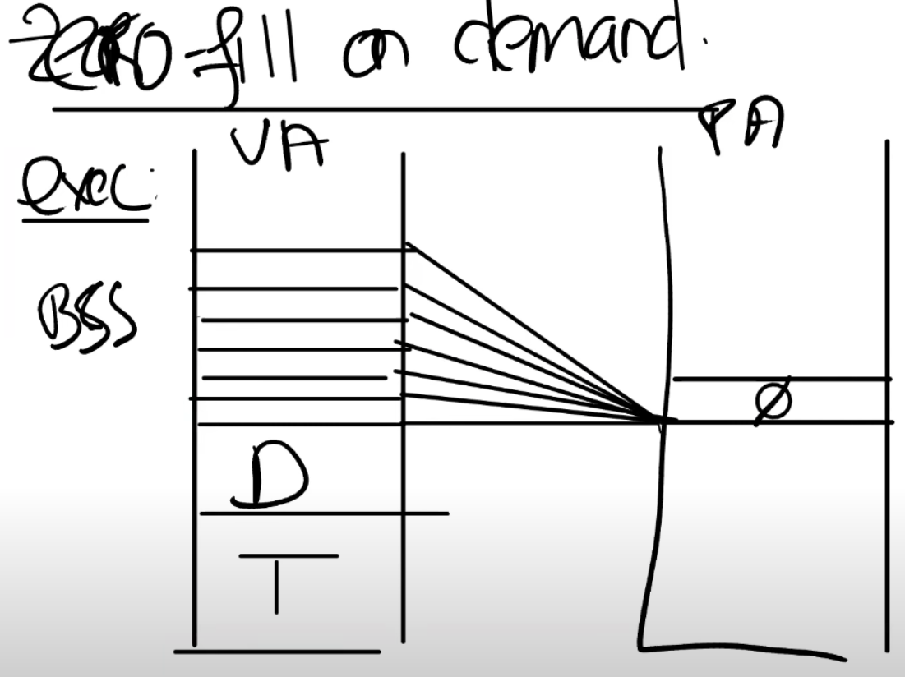
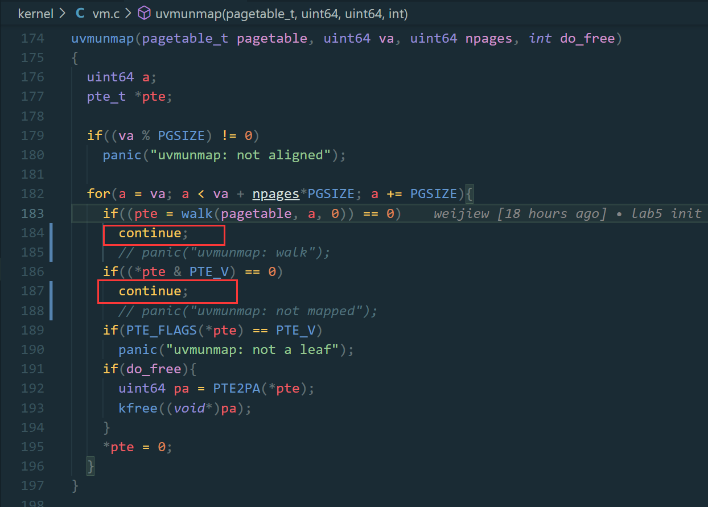
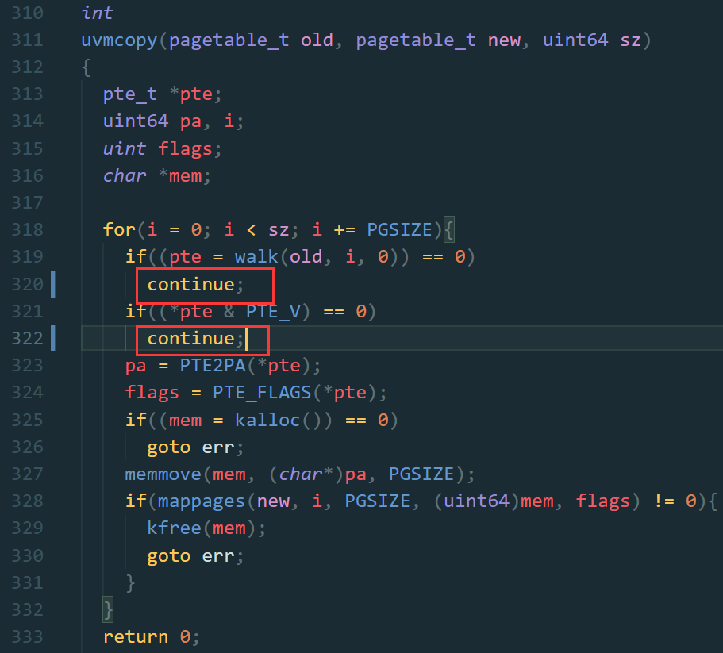

# Lab5

首先阅读实验手册 [Lab: xv6 lazy page allocation](https://pdos.csail.mit.edu/6.S081/2020/labs/lazy.html) / [中文](http://xv6.dgs.zone/labs/requirements/lab5.html) 。

首先切换分支：

  $ git fetch
  $ git checkout lazy
  $ make clean

接下来学习前置内容.

## 0. 总结

总的来说,当申请内存的时候是立即分配.这个实验要实现的是只有真正使用的时候才会立即分配内存.

> 下面是阅读 [Lec8](https://mit-public-courses-cn-translatio.gitbook.io/mit6-s081/lec08-page-faults-frans) 的一些总结和 

总的来说四块内容:

* lazy allocation
* copy-on-write fork
* demand paging
* memory mapped files

在 XV6 中，一旦用户空间进程触发了page fault，会导致进程被杀掉。

虚拟内存的两个优点：Isolation，level of indirection 。

trampoline page，它使得内核可以将一个物理内存page映射到多个用户地址空间中。

guard page，它同时在内核空间和用户空间用来保护Stack。

直接映射表示虚拟地址就是物理地址。

page fault 三个有价值的信息：

* 引起page fault的内存地址。
* 引起page fault的原因类型。
* 引起page fault时的程序计数器值，这表明了page fault在用户空间发生的位置。

当程序出现 page fault 时会触发 trap 机制，也就是将程序运行切换到内核，同时也会将出错的地址存放在STVAL寄存器中。

SCAUSE 寄存器中保存了触发 page fault 的原因。例如 13 表示是因为 load 引起的 page fault；15 表示是因为 store 引起的 page fault；12 表示是因为指令执行引起的 page fault 。

综上因为 page fault 触发 trap 机制并且进入到内核空间，STVAL 寄存器和 SCAUSE 寄存器都会有相应的值。

第三个信息触发引起page fault时的程序计数器值。通过 trap 机制我们已经了解到这个地址存放在 SEPC（Supervisor Exception Program Counter）寄存器中，并同时会保存在 trapframe->epc 中。关注这个值的目的在于当修复 page table 后可以通过重新执行对应的指令。

sbrk 可以扩大自己的 heap 。最初 sbrk 位于 heap 的底端，同时也是 stack 的顶端。由 p->sz 表示。

默认的 sbrk 是 eager allocation ，也就是一旦调用就立即分配相应的内存。但在实际使用中应用程序所需内存的大小是难以预测的，并且为了考虑最坏的情况分配的内存更倾向于多分配一些。所以常常会导致有些内存永远也用不上。

lazy allocation 的思想是使用的时候在具体分配，而不是一下子分配好。sbrk 调用的时候仅仅是将 `p->sz + n`，n 是需要新分配的内存page数量，此时内核不会分配任何物理内存。直到使用到这块内存时才会去分配物理内存。

所以，如果我们解析一个大于旧的p->sz，但是又小于新的p->sz（注，也就是旧的p->sz + n）的虚拟地址，我们希望内核能够分配一个内存page，并且重新执行指令。

如果出现一个 page fault ，并且虚拟地址小于当前p->sz，同时大于stack，可以认为来自 heap 的内存并且内核还没有分配物理内存。解决这个问题可以通过 kalloc 函数分配一个内存 page 初始化 page 内容为零，并将其映射到用户页表中。然后重新执行指令即可。

eager allocation 可以明确的知道物理内存不够。lazy allocation 当发现物理内存不够的时候有两种解决方案，其一是直接返回一个错误并杀掉进程。

通过 sbrk 扩容后，p->sz 会更新，如果待解析的地址旧的 p->sz 且小于新的 p->sz 则认为是有效地址，只是还未分配。但是大于新的 p->sz 则认为是程序错误。

* Zero Fill On Demand 

用户程序的地址空间分为text区域，data区域，同时还有一个BSS区域.

Copy On Write Fork

子进程和父进程的一些全局变量是共享的,而在此之前子进程复制了一份. 这些变量是只读的.

只有在修改的时候才会单独复制要修改的页并更新映射关系.父进程和子进程都采用同样的处理方式.

当向一个只读 page 执行写操作时,如何区分是普通读写还是 copy-on-write 场景?

通过读取页表的 RSW 位可以判断是否为 copy-on-write 场景进而执行相应的操作。

当多个进程指向同一个物理页的时候其中一个进程不能释放共享的页表,否则会导致其他页的出问题.
通过引用计数来解决这个问题.

* Demand paging

text和data也以 lazy 的方式加载.也就是所谓的按需加载.

如果内存不够用可以选择 LRU 算法.

dirty page 和 non-dirty page 更倾向于撤回后者.因为前者很有可能继续更改.

* Memory Mapped Files

page fault 结合了 page table 和 trap .

## 1. Eliminate allocation from sbrk() (easy)

1. 修改 sysproc.c 中的 sys_sbrk(). 删除对growproc()的调用,更新 sz. 
2. make qmeu 启动 xv6 并输出  echo hi 会报错: 

    $ echo hi
    usertrap(): unexpected scause 0x000000000000000f pid=3
                sepc=0x00000000000012ac stval=0x0000000000004008
    panic: uvmunmap: not mapped

原因是没有读取的内容还没有被映射,也就是没有分配物理内存,这是符合预期的.

## 2. Lazy allocation (moderate)

解决上面的错误,也就是新分配一个物理页面并映射到发生错误的地址，然后返回到用户空间，让进程继续执行。

scause 寄存器中保存了报错原因,由报错可知 `scause 0x000000000000000f` 也就是 15 .

通过查看 RISC-V 的文档可知 15 表示是因为 store 引起的 page fault . (lec8) 而 13 是页错误.

发生 13 或 15 类型的错误,原因是没有真正的分配内存,这是符合预期的,因为之前只是简单的修改了 sz .

在 usertrap 中分配内存.通过 r_scause() 获取出错类型,通过 r_stval 获取映射失败的虚拟地址.然后分配内存即可.

接下来运行 make qemu 输出如下内容会出错:

  $ echo hi
  panic: uvmunmap: not mapped

这是因为 lazy 的缘故,消除映射的时候以为映射过了,其实有些地址没有建立映射但是进行了消除.此处简单的 cotinue 即可.

接下来就可以正常输出了:

  $ echo hi
  hi

## Lazytests and Usertests (moderate)

处理 sbrk 参数为负的情况,直接在 sys_sbrk 中处理即可.

处理不合理的地址,地址应当小于 sz 大于 sp .

处理 uvmcopy 函数,发现没有建立映射的内存 cotinue 即可.

修改 fork() 函数,其中需要将父页的内容复制到子页中(uvmcopy),而复制的过程中因为 lazy 的缘故存在一些没有映射的页,所以当发现地址不存在时需要忽略.

接下来是处理系统调用,当发生系统调用执行(exe.c)函数的时候的时候发现地址不存在(walkaddr),需要分配内存并建立相关映射,这块的逻辑和 usertrap 的处理类似了.

## 参考

1. https://zhuanlan.zhihu.com/p/367314945
2. https://blog.miigon.net/posts/s081-lab5-lazy-page-allocation/