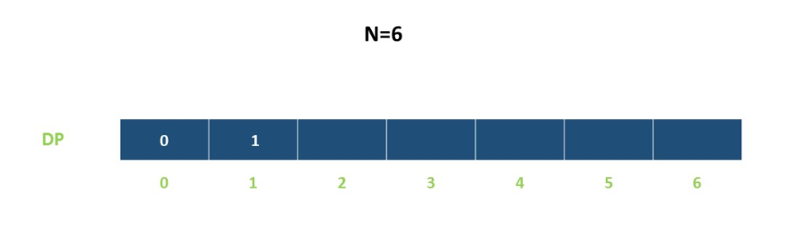
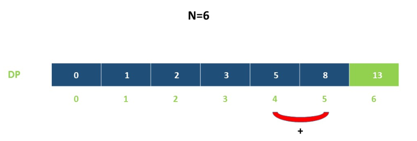

> 动态规划的核心是数学归纳法！
最优子结构：问题的最优解包含着子问题的最优解。也就是通过子问题的最优解得到问题的最优解！


# 1.0 最长公共子序列

什么是序列？什么是子序列？区别是什么？ 

序列必须连续，子序列可以连续也可以不连续！

最长公共子序列 ，即 LCS（Longest Common Subsequence）。用在什么地方？假如小明怀疑自己的儿砸和隔壁老王长得很像，然后小明去做 DNA 鉴定了，很明显需要比对小明和儿砸两条 DNA 的相似程度，而相似度越高来源于两条 DNA 链的公共部分，公共部分多则相似度高，反之比较低！

## 1.1 练手！

[Leetcode_1143](https://leetcode-cn.com/problems/longest-common-subsequence/)

```java
class Solution {
    public int longestCommonSubsequence(String text1, String text2) {
        int m = text1.length();
        int n = text2.length();
        int[][] dp = new int[m+1][n+1];
        for (int i = 1 ; i <= m ; i ++) {
            for (int j =1 ; j <= n ; j ++) {
                if (text1.charAt(i-1) == text2.charAt(j-1)) {
                    dp[i][j] = Math.max(dp[i - 1][j - 1] , dp[i - 1][j - 1] + 1); 
                }else {
                    dp[i][j] = Math.max(dp[i-1][j] , dp[i][j-1]);
                }
            }
        }
        return dp[m][n];
    }
}
```

## 1.2 熟悉！

[VJ_HDU_1159](https://vjudge.net/problem/HDU-1159)

和上一题一样。

```cpp
#include <iostream>
#include <cstring>
#include <cmath>
using namespace std;
string a, b;
int dp[1010][1010];
int main() {
    while(cin >> a >> b) {
        int m = a.length();
        int n = b.length();
        memset(dp, 0, sizeof(dp));
        for (int i = 1; i <= m; i++) {
            for (int j = 1; j <= n; j++) {
                if (a[i - 1] == b[j - 1]) {
                    dp[i][j] = dp[i - 1][j - 1] + 1;
                }else {
                    dp[i][j] = max(dp[i - 1][j], dp[i][j - 1]);
                }
            }
        }
        cout << dp[m][n] << endl;
    } 
    return 0;
}
```

## 1.3 变换！

[VJ_51Nod-1006](https://vjudge.net/problem/51Nod-1006)

这道题同样是求 LCS 但是增加了需要把路径打印出来！

如何将路径打印出来，仔细想一下，问题就变成了将两个字符串相同的字符打印出来，字符相同就是 `dp[i - 1][j - 1] + 1` 的状态。把 dp 表输出看一下，看一下路径变换的规律就可以实现了。

```cpp
#include <iostream>
#include <cstring>
#include <cmath>
using namespace std;
int dp[1010][1010];
char a[1010], b[1010], c[1010];
void lcs(int m, int n) {
    for (int i = 1; i <= m; i ++) {
        for (int j = 1; j <= n; j ++) {
            if (a[i - 1] == b[j - 1]) {
                dp [i][j] = dp[i - 1][j - 1] + 1;
            }else {
                dp [i][j] = max (dp [i - 1][j] , dp [i][j - 1]);
            }
        }
    }
}
void path(int m, int n) {
    int i = m;
    int j = n;
    int k = 0;
    memset(c, 0, sizeof(c));
    while (i != 0 && j != 0) {
        if (a[i - 1] == b[j - 1]) {
            c[k++] = a[--i];
            j--;
        }else if (dp[i - 1][j] <= dp[i][j - 1] ) {
            j--;
        }else if (dp[i - 1][j] > dp[i][j - 1] ) {
            i--;
        }
    }
    for (int i = k - 1; i >= 0; i--) {
        cout << c[i];
    }
    cout << endl;
}
int main() {
    while (cin >> a >> b) {
        int m = strlen(a);
        int n = strlen(b);
        memset(dp , 0, sizeof(dp));
        lcs(m , n);
        path(m , n);
    }    
    return 0;
}
```

在提供一种打印路径的思路，用递归的思想，相对好理解一些，把递归树画一遍后就明白了！

```cpp
void print (int i , int j) {
    if(i == 0 || j == 0)return;
    if (map[i][j] == 0) {
        print(i - 1, j - 1);
        cout << b[j - 1];
    }else if (map[i][j] == 1) {
        print(i - 1, j);
    }else  {
        print(i, j - 1);
    }
}
```


## 1.4 进阶！

路径打印技巧！

[VJ_HDU_1503](https://vjudge.net/problem/HDU-1503)

```cpp
#include <iostream>
#include <cstring>
using namespace std;
char a[1010], b[1010];
int dp[1010][1010];
int map[1010][1010];
void lcs(int m, int n) {
    for (int i = 0; i <= m; i++) {
        map[i][0] = 1;
    }
    for (int j = 0; j <= n; j++) {
        map[0][j] = -1;
    }
        for (int i = 1; i <= m; i++)
        {
            for (int j = 1; j <= n; j++)
            {
                if (a[i - 1] == b[j - 1])
                {
                    dp[i][j] = dp[i - 1][j - 1] + 1;
                    map[i][j] = 0;
                }
                else if (dp[i - 1][j] >= dp[i][j - 1])
                {
                    dp[i][j] = dp[i - 1][j];
                    map[i][j] = 1;
                }
                else
                {
                    dp[i][j] = dp[i][j - 1];
                    map[i][j] = -1;
                }
            }
        }
}
void print(int i, int j) {
    if (!i && !j) return;
    if (map[i][j] == 0) {
        print(i - 1, j - 1);
        cout << a[i - 1];
    }else if (map[i][j] == 1) {
        print(i - 1, j);
        cout << a[i - 1];
    }else {
        print(i, j - 1);
        cout << b[j - 1];
    }
}
int main() {
    while (cin >> a >> b) {
        memset(dp, 0, sizeof(dp));
        memset(map, 0, sizeof(map));
        int m = strlen(a);
        int n = strlen(b);
        lcs(m, n);
        print(m, n);
        cout << endl;
    }
    return 0;
}
```


## 总结

# 2.0 最长上升子序列 （LIS）

最长上升子序列（Longest  Increasing Subsequence）简称 LIS。LIS 就是在里面寻找值不断增加的子序列！

首先将每一个下标的当前的最长上升子序列数存下来，然后再从当前下标和之前的值中取最大值。

初始状态为 1 ， 是因为每一个下标的最长上升子序列就是其本身，也就是 1.

## 2.1 练习！

[Leetcode-300](https://leetcode-cn.com/problems/longest-increasing-subsequence/)

```cpp
class Solution {
public:
    int lengthOfLIS(vector<int>& nums) {
        int len = nums.size();
        int a[nums.size()];
        for (int i = 0; i < len; i++) {
            a[i] = 1;
        }
        
        for (int i = 0; i < len; i++) {
            for (int j = 0; j < i; j++) {
                if (nums[i] > nums[j]) {
                    a[i] = max( a[i] , a[j] + 1);
                }
            }
        }

        int t = 0;
        for (int i = 0; i < len; i++) {
            t = max(a[i], t);
        }
        return t;
    }
};
```

```java
class Solution {
    public int lengthOfLIS(int[] nums) {
        int[] dp = new int[nums.length];
        Arrays.fill(dp,1);
        for (int i = 0; i < nums.length; i++) {
            for (int j = 0; j < i; j++) {
                if (nums[i] > nums[j]) {
                    dp[i] = Math.max(dp[i],dp[j]+1);
                }
            }
        }

        int ans = 0;
        for (int i = 0; i < nums.length; i++) {
            if (dp[i] > ans) {
                ans = dp[i];
            }
        }
        return ans;
    }
}
```


## 2.2 LIS 熟悉！
[Leetcode-646](https://leetcode-cn.com/problems/maximum-length-of-pair-chain/)

* 这道题和[Leetcode-300](https://leetcode-cn.com/problems/longest-increasing-subsequence/)几乎类似，用贪心也可以动态规划反而复杂鉴于目前正在练动态规划，下面是动态规划的写法，贪心写法在贪心的那一节里面。注意 vector 的一些用法。

* 起初我不理解为什么要排序，仔细读题后发现并没有上一题强制的顺序，每一个数对组合都可以任选，而为了实现尽可能多的数对，所以需要先排个序。

* 注意 `pairs[i][0] > pairs[j][1]` ，分析二维数组，外面的 i j 控制第几个数对，内部则控制每个数对（数对一共俩数组成，所以就 0 1 两位）

```cpp
class Solution {
public:
    static bool cmp(vector<int> &a, vector<int> &b) {
        return a[1] < b[1];
    }
    int findLongestChain(vector<vector<int>>& pairs) {
        int len = pairs.size();
        sort(pairs.begin(),pairs.end(),cmp); // 默认升序，可以不用写cmp，不过最好写上严谨一些，题意是任意选数对，所以需要排序
        vector<int> dp(len, 1); // 对 dp 初始化为 1
        int t = 1;
        for (int i = 0; i < len; i++) {
            for (int j = 0; j < i; j++) {
                if (pairs[i][0] > pairs[j][1]) {
                    dp[i] = max(dp[i], dp[j] + 1);
                }
            }
            t = max(t, dp[i]);
        }
        return t;
    }
};
```

## 2.3 掌握！

[Leetcode-376](https://leetcode-cn.com/problems/wiggle-subsequence/)

```cpp
class Solution {
public:
    int wiggleMaxLength(vector<int>& nums) {
        int n = nums.size();
        if (n < 2) {
            return n;
        }
        int up = 1 , down = 1;
        for (int i = 1; i < n; i++) {
            if (nums[i] > nums[i - 1]) {
                up = down + 1;
            }
            if (nums[i] < nums[i - 1]) {
                down = up + 1;
            }
        }
        return max(up, down);
    }
};
```


## 198. 打家劫舍
[戳我](https://leetcode-cn.com/problems/house-robber/description/)
### 思考
转移方程
$$
dp[i] = max(dp[i-2] + nums[i], dp[i+1]) 
$$

### code
```java
class Solution {
    public int rob(int[] nums) {
        int pre1 = 0;
        int pre2 = 0;
        for (int i = 0; i < nums.length; i++) {
            int temp = Math.max(nums[i] + pre2, pre1);
            pre2 = pre1;
            pre1 = temp;
        }
        return pre1;
    }
}
```

## 213. 打家劫舍 II
[戳我](https://leetcode-cn.com/problems/house-robber-ii/)

### 思考
和上一题类似，只不过需要拆分成两个数组，数组的范围分别是：[0,n-1] ,[0,n-2] 。

### code
```java
class Solution {
    public int rob(int[] nums) {
        if (nums.length == 0 || nums == null) {
            return 0;
        }
        if (nums.length == 1) {
            return nums[0];
        }
        return Math.max(search(nums,0,nums.length-2) , search(nums,1,nums.length-1));
    }
    public int search(int[] nums , int l , int m) {
        int pre1 = 0 , pre2 = 0;
        for (int i = l; i <= m; i++) {
            int temp = Math.max(pre2 + nums[i],pre1);
            pre2 = pre1;
            pre1 = temp;
        }
        return pre1;
    }
}
```
## 64. 最小路径和
[戳我](https://leetcode-cn.com/problems/minimum-path-sum/)

### 思考
当前节点存在两走法，向右或向下。

### code
```java
class Solution {
    public int minPathSum(int[][] grid) {
        for (int i = 0; i < grid.length; i++) {
            for (int j = 0; j < grid[0].length; j ++) {
                if (i == 0 && j == 0) {
                    continue;
                }else if (i == 0) {
                    grid[i][j] += grid[i][j-1];
                }else if (j == 0) {
                    grid[i][j] += grid[i-1][j];
                }else {
                    grid[i][j] += Math.min(grid[i-1][j] , grid[i][j-1]);
                }
            }
        }
        return grid[grid.length - 1][grid[0].length - 1 ];
    }
}
```

## 62. 不同路径
[戳我](https://leetcode-cn.com/problems/unique-paths/)
### 思考
和上一题类似，填充边界，注意排列组合的话要防止溢出。

### code
```java
class Solution {
    public int uniquePaths(int m, int n) {
        int [][] a  = new int[m][n];
        for (int i = 0; i < m; i++) {
            a[i][0] = 1;
        }
        for (int j = 0; j < n; j++) {
            a[0][j] = 1;
        }
        for (int i = 1; i < m; i++) {
            for (int j = 1; j < n; j++) {
                a[i][j] = a[i-1][j] + a[i][j-1];
            }
        }
        return a[m-1][n-1];
    }
}
```

## 303. 区域和检索 - 数组不可变

[戳我](https://leetcode-cn.com/problems/range-sum-query-immutable/)

### 思考
注意多次调用，可以将计算结果存起来，直接存储前 n 项和，然后直接查询即可。
### code

```java
class NumArray {
    private int [] sums;
    public NumArray(int[] nums) {
        sums = new int[nums.length+1];
        for (int i = 1; i <= nums.length; i++) {
            sums[i] = sums[i-1] + nums[i-1];
        }
    }
    
    public int sumRange(int i, int j) {
        return sums[j+1] - sums[i];
    }
}
```
## 413. 等差数列划分
[戳我](https://leetcode-cn.com/problems/arithmetic-slices/)
### 思考

### code

```java
class Solution {
    public int numberOfArithmeticSlices(int[] A) {
        int n = A.length;
        int dp = 0 , sum = 0;
        for (int i = 2; i < n; i++) {
            if (A[i] - A[i - 1] == A[i - 1] - A[i-2]) {
                dp = dp + 1;
                sum += dp;
            }else {
                dp = 0;
            }
        }
        return sum;
    }
}
```

## 

```java
class Solution {
    public int integerBreak(int n) {
        if (n <= 3) return n-1;
        int a = n / 3 , b = n % 3;
        if (b == 0) return (int)Math.pow(3 , a);
        if (b == 1) return (int)Math.pow(3 , a-1) * 4;
        return (int)Math.pow(3 , a) * 2;
    }
}
```

## 1.5 交换硬币

[322. 零钱兑换](https://leetcode-cn.com/problems/coin-change/)

### 思考

### code
```java
class Solution {
    public int coinChange(int[] coins, int amount) {
        int[] dp = new int[amount + 1];
        for (int i = 0 ; i < dp.length ; i ++) {
            dp[i] = amount + 1;
        }
        dp[0] = 0;
        for (int i = 0 ; i < dp.length ; i ++) {
            for (int j = 0 ; j < coins.length ; j ++) {
                if (i < coins[j]) continue;
                dp[i] = Math.min(dp[i] , 1 + dp[i - coins[j]]);
            }
        }
        return dp[amount] == amount + 1 ? -1 : dp[amount];
    }
}
```

# 3.0 斐波那契数列

## 3.1 爬楼梯

[Leetcode-70](https://leetcode-cn.com/problems/climbing-stairs/)

通过观察可以发现如下规律！



以上是最基本的情况，当台阶为 0 之时显然存在 (0) 一步走上去即可。


当台阶为 2 时，存在 (1 + 1) (2) 两种情况， 

当台阶数位 3 时，存在 (1 + 1 + 1) (1 + 2) (2 + 1) 3 种组合。

将台阶为 6 的情况枚举出来后发现 13(6) = 8 (5) + 5 (4) 发现了这个规律。也就是 f(n) = f(n-1) + f(n-2) 斐波那契数列。


```cpp
class Solution {
public:
    int climbStairs(int n) {
        if (n < 2) {
            return n;
        }
        int m = 1 , k = 2;
        for (int i = 2; i < n; i++) {
            int pre = m + k;
            m = k;
            k = pre;
        }
        return k;
    }
};
```

## 3.2 练习!
[Leetcode-198](https://leetcode-cn.com/problems/house-robber)

和爬楼梯类似，但又有了变换，dp[i] = max(dp[i-2]+nums[i], dp[i-1])

当考虑当前房子是否抢当前房子时，需要考虑抢当前房子和前面的前面房子价值和高还是抢前一个房子价值高。

```cpp
class Solution {
public:
    int rob(vector<int>& nums) {
        int m = 0 , n = 0;
        for(int i = 0 ; i < size(nums) ;i++) {
            int t = max(m+nums[i] , n);
            m = n;
            n = t;
        }
        return n;
    }
};
```
## 3.3 练习!
[Leetcode-213](https://leetcode-cn.com/problems/house-robber-ii/)

上一题的变形，因为首位相接，如果按照原来的思路会导致首尾相接的情况出现，导致警报出现。

修改为两个范围 [0,n-2] [1,n-1] 的情况即可。也就是拆分成了两种情况使得不会出现收尾相接的情况。
```cpp
class Solution {
public:
    int rob(vector<int>& nums) {
        if (size(nums) == 0) return 0;
        if (size(nums) == 1) return nums[0];
        return max(def(nums,0,size(nums) - 2) , def(nums,1,size(nums) - 1));
    }
    int def(vector<int>& nums, int a, int b) {
        int m = 0 , n = 0;
        for(int i = a ; i <= b ;i++) {
            int t = max(m+nums[i] , n);
            m = n;
            n = t;
        }
        return n;
    }
};
```

# 4.0 数组区间

## 4.1 区间和
[Leetcode-303](https://leetcode-cn.com/problems/range-sum-query-immutable/)
关于区间和存在很多做法，这个专题是动态规划，动态规划的写法如下。只不过是将前缀和记录下来直接查询。

sums[n] 代表前 n-1 个数的前缀和。

对于样例遍历过程如下：

* sums[1] = sums[0] + nums[0] = 0 + (-2) = -2;
* sums[2] = sums[1] + nums[1] = (-2) + (0) = -2;
* sums[3] = sums[2] + nums[2] = (-2) + (3) = 1;
* sums[4] = sums[3] + nums[3] = (1) + (-5) = -4;
* sums[5] = sums[4] + nums[4] = (-4) + (2) = -2;
* sums[6] = sums[5] + nums[5] = (-2) + (-1) = (-3);
* sums[7] = sums[6] + nums[6] = (-3) + (-1) = (-4);

```cpp
class NumArray {
private: 
    vector<int> sums;
public:
    NumArray(vector<int>& nums) {
        sums.resize(nums.size() + 1);
        for (int i = 0; i < size(nums); i++) {
            sums[i+1] = sums[i] + nums[i];
        }
    }
    
    int sumRange(int i, int j) {
        return sums[j+1] - sums[i];
    }
};
```

## 4.2 等差数列
[Leetcode-413](https://leetcode-cn.com/problems/arithmetic-slices)
dp 代表以当前数字结尾的等差数列个数，记住是当前数字结尾的等差数列。


```cpp
class Solution {
public:
    int numberOfArithmeticSlices(vector<int>& A) {
        if (size(A) == 0) {
            return 0;
        }
        int n = size(A);
        int dp = 0;
        int sum = 0;
        for (int i = 2; i < n; i++) {
            if (A[i] - A[i-1] == A[i-1] - A[i-2]) {
                dp++;
                sum +=dp;
            }else{
                dp = 0;
            }
        }
        return sum;
    }
};
```
# 5.0 矩阵路径和

## 5.1 练习！
[Leetcode-64](https://leetcode-cn.com/problems/minimum-path-sum)

注意处理好边界情况，除此之外就是考虑从上边下来还是从左边过来的情况了，将结果保存起来然后判断。

```cpp
class Solution {
public:
    int minPathSum(vector<vector<int>>& grid) {
        int m = grid.size();
        int n = grid[0].size();
        if (m == 0 || n == 0) {
            return 0;
        }
        for(int i = 0; i < m ; i++) {
            for(int j = 0; j < n; j++) {
                if (i ==0 && j != 0) {
                    grid[i][j] += grid[i][j-1];
                }
                if (i != 0 && j == 0) {
                    grid[i][j] += grid[i-1][j];
                }
                if (i != 0 && j != 0) {
                    grid[i][j] += min(grid[i-1][j] , grid[i][j-1]);
                }
            }
        }
    return grid[m-1][n-1];
    }
};
```
## 5.2 练习！
[Leetcode-62](https://leetcode-cn.com/problems/unique-paths/)

里面有滚动数组的思想，外层循环的状态保存了下来直接拿过来，这一题没有判断，在 0/1 背包里面存在。

```cpp
class Solution {
public:
    int uniquePaths(int m, int n) {
        vector<int> dp(m,1);
        for (int i = 1; i < n ; i++) {
            for (int j = 1; j < m; j++) {
                dp[j] += dp[j-1];
            }
        }
        return dp[m-1];
    }
};
```

# 01背包
背包问题存在很多种类型，


## 推荐资料

[背包九讲](https://github.com/tianyicui/pack)