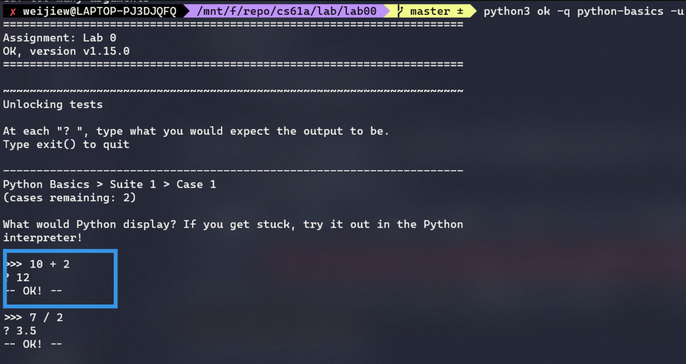
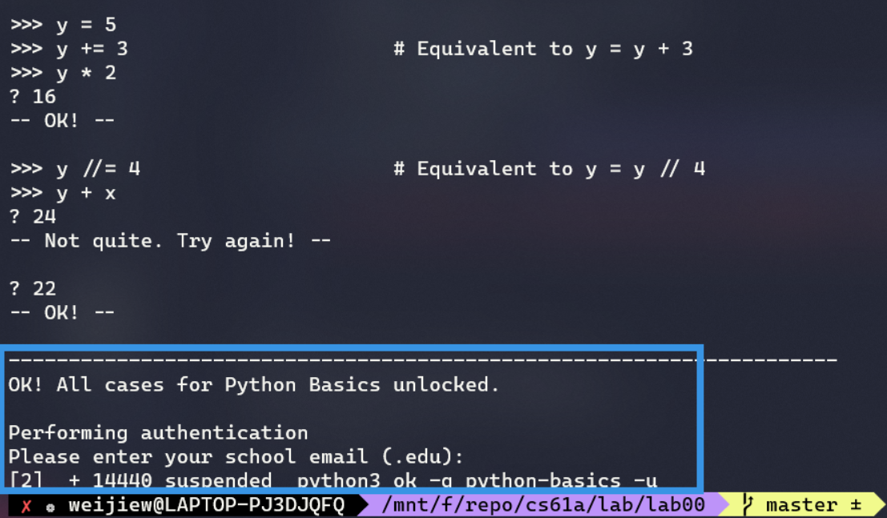
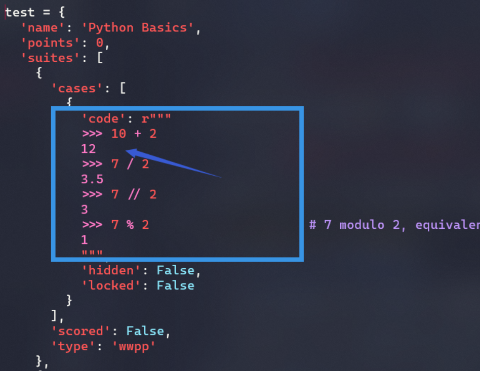
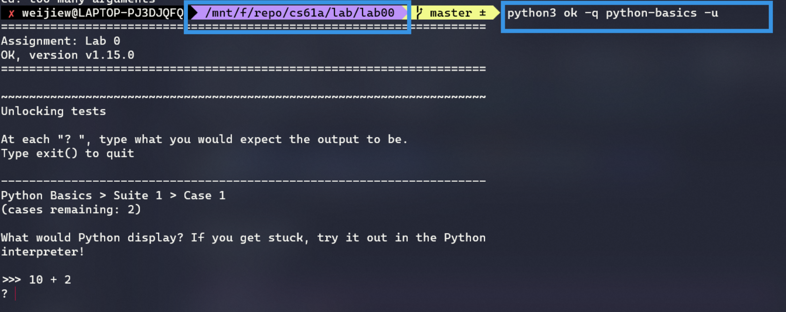

# Lab 00

这个实验主要是环境搭建和 Python 的基本语法学习。

如果没有学过 Python 略微有些吃力。其实没什么问题，需要的前置知识并不多。 Just do it！



对于前者而言，如果答对，文件会解锁，也就是通过验证后如下内容会显示正确的答案，而非目前所见的乱码。其实目前所见的就是正确答案的加密字符。


做完之后会提示输入邮箱，不用理会，ctrl + c 中断即可。



如果嫌提示输入邮箱烦人，可以在命令后加上 `--local` 参数，表示本地测试。建议加上 `--local` 。

通过测试后，文件解锁，加密内容变为正确答案，注意如果不加 `--local` 参数，即使全部答对题目，但因为 ctrl + c 没有正常结束程序，所以加密内容不会还原。



我是从 [Doing the assignment](https://inst.eecs.berkeley.edu/~cs61a/sp20/lab/lab00/#doing-the-assignment) 开始的，之前的内容为环境配置以及一些 Linux 命令学习。

## Doing the assignment

下面的几道测试题，用于判断文中提到的 python 语法。

在下载好的 lab00 文件的工作目录中执行命令。

直接在当前的工作空间中输入命令即可：`python3 ok -q python-basics -u`



交互式输入答案即可。

我已经通过了这个文件，为避免篇幅过长，具体答案可查看此处: [python-basics.py](https://github.com/weijiew/cs61a/blob/master/lab/lab00/tests/python-basics.py) 。

## coding

通过给定的操作符，最终结果等于 2020 即可。

```python
def twenty_twenty():
    """Come up with the most creative expression that evaluates to 2020,
    using only numbers and the +, *, and - operators.

    >>> twenty_twenty()
    2020
    """
    return 2019 + 1
```

通过键入命令 `python3 ok --local` 来对代码进行测试，测试结果如下。没有失败的测试用例则表示通过。


## 总结

该实验主要是熟悉环境以及如何测试，python 的一些简单语法。