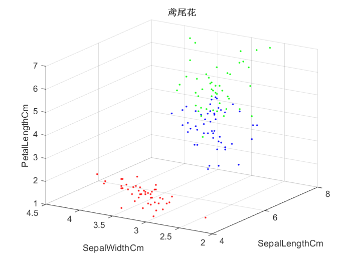

# KNN 代码实现

* 环境：Matlab R2020a
* 源代码：[my-ml/5-KNN/](https://github.com/weijiew/my-ml/tree/master/5-KNN)
* 数据集：[Iris](https://github.com/weijiew/my-ml/blob/master/data/Iris.csv) (老师提供，原数据集没有做任何改动。所有数据的改动都是在内存中进行，这是我的仓库。)
  * 共 150 条数据，分三类，取每一类前 40 条数据作为 训练集，后 10 条数据作为测试集。
  * 训练集：120 条数据。
  * 测试集：30 条数据。


## 概览

一共四个文件

* main.m       => 主流程
* viewData.m   => 查看原始数据的分布，最多三个属性（xyz）。
* calCorrect.m => 计算正确率，遍历测试集，套用 my_knn 函数预测分类结果。
* my_knn.m     => 采用投票法计算统计分类结果。
* calDis.m     => 计算距离。

## 代码

* main.m       => 主流程

```shell
clc,clear;

% 导入数据并生成对应的标签。
% 因为原来数据集以 50 为单位分好了记录这里就直接矩阵生成。
Data = xlsread('../data/Iris.csv');
Label = [ones(50,1);ones(50,1)*2;ones(50,1)*3];

% 可视化当前数据集
vd = [Data(:,2:5),Label];
viewData(vd);

% 每一类前 40 条作为训练数据
trainData = [Data(1:40,:);Data(51:90,:);Data(101:140,:)];
trainLabel = [Label(1:40,:);Label(51:90,:);Label(101:140,:)];

% 每一类后 10 条为测试数据
testData = [Data(41:50,:);Data(91:100,:);Data(141:150,:)];
testLabel = [Label(41:50,:);Label(91:100,:);Label(141:150,:)];

c1 = calCorrect(trainData,trainLabel,testData,testLabel,1)
c2 = calCorrect(trainData,trainLabel,testData,testLabel,2)
c3 = calCorrect(trainData,trainLabel,testData,testLabel,5)

% 正确率:
% L1-范式：0.3333 (曼哈顿距离)
% L2-范式：0.6667 (欧氏距离)
% L3-范式：0.6667
```

* viewData.m   => 查看原始数据的分布，最多三个属性（xyz）。
  * 输入：带标签的数据。
  * 输出：三个属性的数据分布。

```shell
function viewData(Data)

% 数据可视化，最多到三维，x y z 分别表示三个属性

l1=find(Data(:,5)==1);
l2=find(Data(:,5)==2);
l3=find(Data(:,5)==3);

plot3(Data(l1,1),Data(l1,2),Data(l1,3),'.r');%第一类鸢尾花
hold on

plot3(Data(l2,1),Data(l2,2),Data(l2,3),'.b');%第二类
hold on

plot3(Data(l3,1),Data(l3,2),Data(l3,3),'.g');%第三类
grid on 

xlabel('SepalLengthCm');
ylabel('SepalWidthCm');
zlabel('PetalLengthCm');
title('鸢尾花');
end
```

* calCorrect.m => 计算正确率，遍历测试集，套用 my_knn 函数预测分类结果。
  * 输入：训练数据，训练数据标签，测试数据，测试数据标签，距离计算方式。
  * 输出：正确率。

```shell
function corr_rate = calCorrect(trainData,trainLabel,testData,testLabel,r)

topK = 21;
len = length(testData);
error = 0;

    for i = 1:len
        x = testData(i,:);
        y = my_knn(trainData,trainLabel,x,topK,r);
        if y ~= testLabel(i)
            error = error + 1;
        end
    end

corr_rate = 1 - (error/len);

end
```

* my_knn.m     => 采用投票法计算统计分类结果。
  * 输入：训练数据，训练数据标签，要预测数据的属性，选取前 K 个，距离计算方式。
  * 输出：分类结果。


```shell
function preLabel = my_knn(trainData,trainLabel,x,topK,r)

len = length(trainData);
dis = zeros(len,1);

    for i = 1:len
        % 遍历所有的训练数据        
        xx = trainData(i,:);
        % 将数据存放到对应位置          
        dis(i) = calDis(x,xx,r);
    end
    
    % 首先设置索引，因为对数据要进行排序，
    % 最终是要拿到前 topK 条数据的索引。
    index1 = (1:1:len)'; 
    dis = [dis,index1];
    % 排序时连着整行都排序，保证了第二列索引的有效    
    dis_sorted = sortrows(dis,1);
    dis_k = dis_sorted(1:topK,:);
    
    listLabel = zeros(3,1);
    
    % 遍历 topK 根据投票法选出票数最多的类
    for i = 1:length(dis_k)
        ii = dis_k(i,2);
        iii = trainLabel(ii,1);
        listLabel(iii,1) = listLabel(iii,1) + 1;
    end
    
    index2 = (1:1:3)';
    lisLabel = [listLabel,index2];
    t = sortrows(lisLabel,-1);    
    preLabel = t(1,2);
end
```

* calDis.m     => 计算距离。
  * 输入：数据 a，数据 b ，距离计算参数。
  * 输出：两个数据点之间的距离。

```bash
function dis = calDis(a,b,r)

% 距离函数
dis = (sum((a-b).^r)).^(1/r);

end
```

## 结果

```shell
% 正确率:
% L1-范式：0.3333 (曼哈顿距离)
% L2-范式：0.6667 (欧氏距离)
% L3-范式：0.6667
```



## 参考

1. [Statistical-Learning-Method_Code](https://github.com/Dod-o/Statistical-Learning-Method_Code/blob/master/KNN/KNN.py)