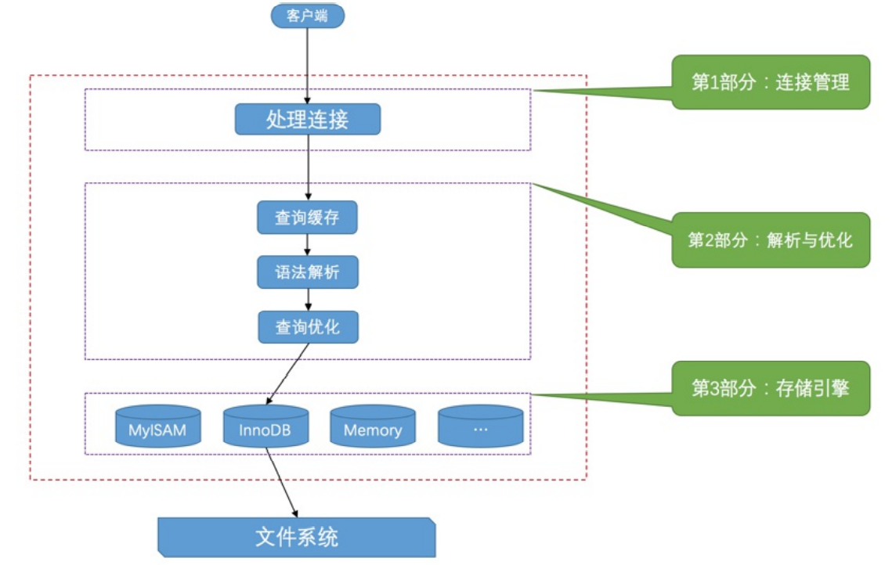
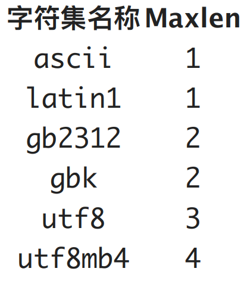

## 1. 数据库三大范式是什么？

> 什么是范式？

一张表的结构符合某种设计标准。

> 什么是关系模式？什么是关系？二者的区别是什么？

“关系模式”和“关系”的区别类似于“类”与“对象”的区别。

关系是带数据的表，而关系模式是这张表的表结构。

> 什么是第一范式？

表的每一列都不能再分，原子级别。

> 只满足第一范式存在什么问题？

数据冗余，插入异常，删除异常，修改异常。

> 什么是第二范式？

第二范式在第一范式的基础上消除了**非主属性**对于**码**的**部分函数依赖**。

函数依赖：属性 a 能确定属性 b ，此时属性 b 函数依赖属性 a 写作 a → b。例如学号可以唯一确定姓名，那么可以说姓名函数依赖于学号。但是反过来不行，例如存在重名的情况，同样的姓名但是学号不一样。

完全函数依赖：函数依赖 X → Y 中的 X 任何一个真子集都不成立称 Y 对于 X 完全函数依赖。

部分函数依赖：不是完全函数依赖的称之为部分函数依赖。

传递函数依赖：Z 函数依赖于 Y 且 Y 函数依赖于 X 。Z 和 X 存在部分函数依赖。

码：码可以是一个集合，除这个集合之外的其他属性都完全函数依赖于该集合，那么称这个集合为候选码。在这个集合中选一个属性作为主码。

主属性是包含在候选码中的属性，非主属性是候选码之外的属性。

> 如何判断是否符合第二范式？

首先找到码，然后找出所有的主属性，剩余的属性都是非主属性，查看非主属性对码是否存在函数依赖。(就是组合一下看是否能确定剩余的属性)

> 什么是第三范式？

在2NF基础上，消除了非主属性对于码的传递函数依赖。

第三范式需要确保数据表中的每一列数据都和主键直接相关，而不能间接相关。

> 三范式的优点？

在设计数据库结构的时候，要尽量遵守三范式，如果不遵守，必须有足够的理由。比如性能。事实上我们经常会为了性能而妥协数据库的设计。

（1）简单归纳：

　　第一范式（1NF）：字段不可分；
　　第二范式（2NF）：有主键，非主键字段依赖主键；
　　第三范式（3NF）：非主键字段不能相互依赖。

（2）解释：

　　1NF：原子性。 字段不可再分,否则就不是关系数据库;；
　　2NF：唯一性 。一个表只说明一个事物；
　　3NF：每列都与主键有直接关系，不存在传递依赖。

范式的优点：消除了重复的冗余数据，更新快，修改少。

缺点：查询导致很多关联，效率变低。

> 什么是 BCNF 范式？

在 3NF 的基础上消除主属性对于码的部分与传递函数依赖。

参考自：https://www.zhihu.com/question/24696366/answer/29189700

## 2. InnoDB 与 MyISAM 的区别？

InnoDB 将数据和索引放在一起保存在一个文件(.ibd)中，而 MyISAM 将表结构.frm 索引.myi 数据.myd 分别存放。

InnoDB 支持聚簇索引，而 MyISAM 不支持聚簇索引。

3. InnoDB 支持事务、外键、行锁表锁，MyISAM 不支持事务、外键、只支持表锁 。
4. select count(*)
5. InnoDB更新更优，MyISAM查询更优。
6. 都是B+tree索引。
7. MyISAM支持全文索引，InnoDB 5.6 后支持。

## 服务器处理客户端请求的查询流程

总的来看，客户进程向服务进程发送一段文本语句。服务进程处理后将结果发送给客户进程。

1. 连接管理：
   1. 客户端连接服务端，服务端创建一个线程来处理。
   2. 客户端退出时断开连接，服务端将线程缓存而非销毁，目的是等待别的客户端连接避免频繁的创建销毁。
   3. 服务端会为所有每一个连接分配一个线程，线程的数量存在上限。
   4. 安全反面的优化。
2. 解析与优化：
   1. 查询缓存：注意一旦更改表那么和表相关的所有缓存都会失效。
   2. 语法解析：
   3. 查询优化：生成一个执行计划，确定表的连接顺序等。
3. 存储引擎：
   1. 读取数据。
   2. 写入数据。
   3. 可以为不同的表设置不同的存储引擎。

## MySQL 字符集

1. utf8mb3：阉割过的utf8字符集，只使⽤1～3个字节表示字符。
2. utf8mb4：正宗的utf8字符集，使⽤1～4个字节表示字符。

在 MYSQL 中，默认的 UTF8 是指 utf8mb3 如果要存 4 字节的字符，例如 emoji 需要指定 utf8mb4。

## 3. 什么是聚集？

## 4. 什么是 OLTP，OLAP ？

## 5. 数据库(DB)和数据库管理系统(DBMS)的区别？

* DB 是存储数据的仓库，本质上是一个文件系统。
* DBMS 是用于操纵和管理的软件，对数据库进行统一的管理。

## 6. 表，记录，字段。

一个实体就是一行数据。实体集中有多个实体，也就是表。

一个属性是一个字段，也就是对应一列数据。

## 7. 关系模型(ER)

一共四种关系：

1. 一对一
2. 一对多
3. 多对多
4. 自我引用

## 9. Mysql的事务原理

事务：满足 ACID 的一系列操作，要么全部成功，要么全部失败

事务的 ACID 特性：

1. 原子性（Atomicity，或称不可分割性），不可分割，要么
2. 一致性（Consistency）
3. 隔离性（Isolation）
4. 持久性（Durability）

虽然要满足 ACID 才算事务，但是大多数都不满足，所以 ACID 可以理解为衡量事务的四个维度。

### 9.1 如何实现事务的原子性？

首先事物是指一组操作，而原子性是指这组操作要么都做完，要么都不做，不存在中间态。

所以执行到中间态时终止的话，需要把之前做的工作都撤销，回到之前的状态。

# 参考

1. [MySQL数据库教程天花板，mysql安装到mysql高级，强！硬！](https://www.bilibili.com/video/BV1iq4y1u7vj)
2. [数据库设计的三大范式怎么通俗理解？](https://www.html.cn/qa/other/18877.html)
3. [《面试笔记》——MySQL终结篇（30问与答）](https://mp.weixin.qq.com/s?__biz=MzkxMjE5NzUxNQ==&mid=2247483876&idx=1&sn=3ba83e9184f850c49a0b98e6e49513b3&chksm=c111d300f6665a16af6199d869d715186e969df0a9c207b0c216b91ed299f5f006cdea188a4b&token=1231184118&lang=zh_CN#rd)

