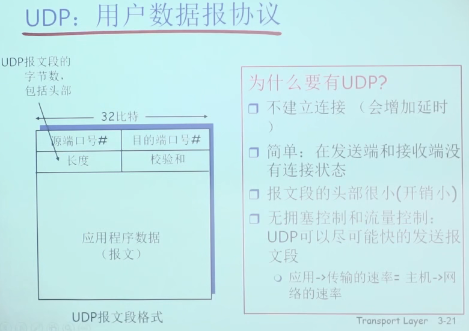
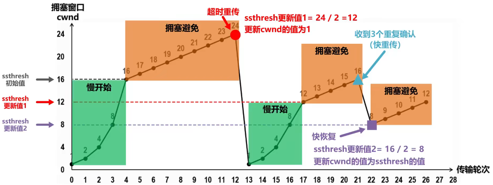

# UDP 协议

无连接的传输层协议，因为无连接所以不可靠。功能简单，没有流量控制，没有拥塞控制。

头部只有八字节所以开销小，源端口，目的端口，长度和校验和。

* 长度为报文段的字节数加上头部的字节数。
* 校验和是针对报文整体，包含数据报部分和头部计算出来一个数值，保证数据在运输过程中不出错。

适用于实时场景，例如视频多媒体之类。

# TCP 协议是什么？

TCP 是面向连接的可靠传输协议。TCP 是点对点，UDP 是一对多的协议。

GBN 协议是针对第一个发送的数据报进行计时，然后将之后的所有数据报重传。

SR 协议是针对发送窗口中的所有数据报，哪个数据报超时就重传哪个。

## TCP 多少字节？最大传输单元？

最大传输单元（MTU） 1500 字节，IP 头部 20 字节，TCP 头部 20 字节，所以 TCP 的数据报最多 1460 字节。

https://www.ruanyifeng.com/blog/2017/06/tcp-protocol.html

## 流量控制和拥塞控制区别？

流量控制是指控制两点之间的流量传输速度，通过调整窗口尺寸来实现，属于局部。
而拥塞控制是根据整个网络的拥塞情况来调整数据传输，拥塞情况则用丢包，超时等信息来判断，属于全局。

## 拥塞控制流程？

慢开始，拥塞避免，快重传，快恢复。

慢开始：拥塞窗口指数增长到设置的值。

快重传是指当收到连续三个连续的重复确认就重传，而不是等待超时再重传。

## 什么是累计确认？

例如接收端收到了 1，2，3，4，5 而发送端收到了 3 的确认，发送端就不用再逐个确认 1，2 了。收到 3 表示 3 之前的都已经收到了。

