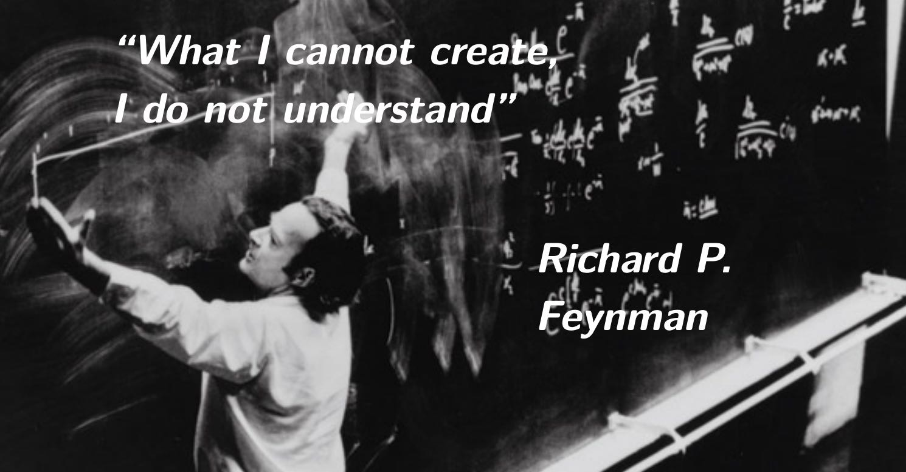

<div align="center">

  <a href="https://github.com/jieway/everystep">
    
  </a>

  

</div>

## 简介

该项目最初为写名校 lab 过程中留下了的记录，最初只是单纯想记录实现的心路历程，所踩过的坑，但是因为[学术诚信](http://integrity.mit.edu/)的缘故，公开解决方案甚至代码是不合适的。但是直接删了有点可惜，后来想尝试换一门语言重写 lab/proj/hw 等内容，所以逐渐演化为用其他语言重写，造轮子过程中的笔记。例如从零实现 OS/Compiler/DB/ld 等，此外和课程答案相关的内容确实会逐渐删去。

<!-- ## 🐲 从零实现模拟器(TODO)

1. 使用 C++23 从零实现 RISC-V 模拟器
2. 使用 C++23 从零实现 RISC-V 模拟器（1）：最简 CPU
3. 使用 C++23 从零实现 RISC-V 模拟器（2）：内存和总线
4. 使用 C++23 从零实现 RISC-V 模拟器（3）：指令解析

## 🍼 从零实现 RPC

## 😈 从零实现 WebServer

## 🐹 从零实现编译器(TODO)

## 🐷 从零实现 OS (TODO)

## 🚀 从零实现数据库(TODO)
 -->

## 本地运行

```
git clone https://github.com/jieway/everystep.git
cd everystep && mdbook serve --open
```

## 贡献

欢迎任何意义上能够优化项目的贡献。