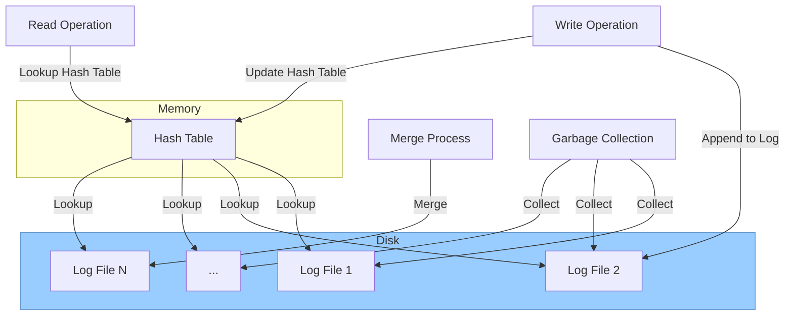

# BitCask 简介

BitCask 是一种简单的存储引擎，可以快速浏览下面的内容有一个整体的认识，后续会结合代码详细解释细节。

[bitcask-intro](https://riak.com/assets/bitcask-intro.pdf) 是对应的论文，可以进一步阅读。

## 什么是存储引擎？

存储引擎是数据库的核心组件，负责存储和管理数据。存储引擎以插件的形式存在，每个数据库可以支持多个存储引擎。

存储引擎的主要功能包括：

* 数据存储：存储引擎负责将数据存储到磁盘或内存中。
* 数据索引：存储引擎负责为数据建立索引，以便快速查找数据。
* 数据操作：存储引擎负责对数据进行插入、删除、更新等操作。

不同的存储引擎具有不同的特性和性能，适用于不同的应用场景。例如，InnoDB 存储引擎支持事务处理，适用于在线事务处理（OLTP）应用；MyISAM 存储引擎不支持事务处理，但具有较高的性能，适用于数据库备份和报表等应用。

Bitcask 存储引擎的设计目标是提供高性能、高可靠性和低成本的存储解决方案。Bitcask 存储引擎采用了简单的设计，使用固定大小的文件存储数据，并使用哈希索引来快速查找数据。

Bitcask 存储引擎的主要特性包括：

* 高性能：Bitcask 存储引擎采用了简单的设计，因此具有较高的性能。
* 高可靠性：Bitcask 存储引擎使用了多种技术来保证数据的可靠性，包括日志记录、数据复制和数据校验。
* 低成本：Bitcask 存储引擎使用了固定大小的文件存储数据，因此成本较低。

Bitcask 存储引擎适用于以下应用场景：

* 日志数据库：Bitcask 存储引擎具有高性能和高可靠性，因此适用于日志数据库。
* 缓存系统：Bitcask 存储引擎具有高性能和低成本，因此适用于缓存系统。
* 数据分析：Bitcask 存储引擎具有高可靠性和低成本，因此适用于数据分析。

Bitcask 存储引擎的具体工作原理如下：

Bitcask 存储引擎使用了固定大小的文件存储数据，每个文件称为一个段（segment）。段的大小可以根据实际需要进行调整。

数据写入 Bitcask 存储引擎时，首先会将数据写入一个日志文件中。日志文件是一个追加写文件，因此可以保证数据的顺序性。

当日志文件达到一定大小时，会被切分为一个段。段会被追加到一个段列表中。

数据查找时，会先在段列表中查找对应的段。然后，根据哈希索引查找数据。

Bitcask 存储引擎的优缺点如下：

**优点**

* 高性能：Bitcask 存储引擎采用了简单的设计，因此具有较高的性能。
* 高可靠性：Bitcask 存储引擎使用了多种技术来保证数据的可靠性。
* 低成本：Bitcask 存储引擎使用了固定大小的文件存储数据，因此成本较低。

**缺点**

* 不支持事务处理：Bitcask 存储引擎不支持事务处理。
* 不支持复杂查询：Bitcask 存储引擎只支持简单的查询，不支持复杂查询。

总体而言，Bitcask 存储引擎是一个高性能、高可靠性和低成本的存储引擎。适用于日志数据库、缓存系统和数据分析等应用场景。

## BitCask 架构

BitCask 采用了简单的设计，使用固定大小的文件存储数据，并使用哈希索引来快速查找数据。

BitCask 存储引擎的架构可以分为以下几个部分：

* **数据存储**：BitCask 存储引擎使用固定大小的文件存储数据，每个文件称为一个段（segment）。段的大小可以根据实际需要进行调整。
* **数据索引**：BitCask 存储引擎使用哈希索引来快速查找数据。哈希索引将键映射到段和位置。
* **数据操作**：BitCask 存储引擎支持插入、删除和更新等数据操作。

**数据存储**

BitCask 存储引擎使用固定大小的文件存储数据，每个文件称为一个段（segment）。段的大小可以根据实际需要进行调整。

数据写入 BitCask 存储引擎时，首先会将数据写入一个日志文件中。日志文件是一个追加写文件，因此可以保证数据的顺序性。

当日志文件达到一定大小时，会被切分为一个段。段会被追加到一个段列表中。

**数据索引**

BitCask 存储引擎使用哈希索引来快速查找数据。哈希索引将键映射到段和位置。

当需要查找数据时，会先在哈希索引中查找键。如果找到了键，则可以根据索引信息直接定位到段和位置。

**数据操作**

BitCask 存储引擎支持插入、删除和更新等数据操作。

插入操作：将数据写入日志文件。

删除操作：将数据从段中删除，并更新哈希索引。

更新操作：将数据从段中删除，然后插入新的数据。

**BitCask 的优势**

BitCask 具有以下优势：

* 高性能：BitCask 采用了简单的设计，因此具有较高的性能。
* 高可靠性：BitCask 使用了多种技术来保证数据的可靠性，包括日志记录、数据复制和数据校验。
* 低成本：BitCask 使用了固定大小的文件存储数据，因此成本较低。

**BitCask 的劣势**

BitCask 具有以下劣势：

* 不支持事务处理：BitCask 不支持事务处理。
* 不支持复杂查询：BitCask 只支持简单的查询，不支持复杂查询。

## 写操作流程

在 Bitcask 中，写操作涉及到以下几个步骤：

1. **将数据写入日志文件**

数据写入 Bitcask 时，首先会将数据写入一个日志文件中。日志文件是一个追加写文件，因此可以保证数据的顺序性。

日志文件的格式如下：

```
<键> <值> <时间戳>
```

其中，键是数据的键，值是数据的值，时间戳是数据写入的时间戳。

2. **将日志文件切分为段**

当日志文件达到一定大小时，会被切分为一个段。段的大小可以根据实际需要进行调整。

段的格式如下：

```
<键> <值> <时间戳>
```

3. **将段追加到段列表中**

段会被追加到一个段列表中。段列表用于记录所有已创建的段。

4. **更新哈希索引**

哈希索引将键映射到段和位置。在将数据写入段后，需要更新哈希索引，以便快速查找数据。

更新哈希索引的步骤如下：

```
1. 计算键的哈希值。
2. 查找哈希索引，找到对应的段和位置。
3. 如果段和位置不存在，则将段和位置添加到哈希索引中。
4. 如果段和位置存在，则更新哈希索引中的值。
```

需要注意的是，Bitcask 不支持事务处理。如果写操作失败，则数据可能丢失。

当读取数据时，根据 key 直接从哈希表中获取相应的 value 。

当写入数据时，将 key 和 value 打包以追加的方式写入日志文件中，与此同时还要将 kv 插入哈希表中。

## 读操作流程

Bitcask 读操作涉及到以下几个步骤：

1. **在哈希索引中查找键**

读操作首先会在哈希索引中查找键。如果找到了键，则可以根据索引信息直接定位到段和位置。

2. **读取数据**

根据索引信息，读取数据所在的段和位置。

3. **返回数据**

将数据返回给客户端。
当更新数据时，


## API 设计


Bitcask 的 API 非常简单，只有以下几种操作：

* **打开数据库**：`bitcask:open(DirectoryName)` 用于打开一个新的或现有的数据库。如果指定了 `read write` 选项，则表示该进程可以进行写操作。如果指定了 `sync on put` 选项，则表示每次写操作后会将数据同步到磁盘。
* **读取数据**：`bitcask:get(BitCaskHandle, Key)` 用于读取数据库中指定键的数据。如果数据存在，则返回 `{ok, Value}`；如果数据不存在，则返回 `not found`。
* **写入数据**：`bitcask:put(BitCaskHandle, Key, Value)` 用于写入数据库中指定键的数据。如果写入成功，则返回 `ok`；如果写入失败，则返回错误信息。
* **删除数据**：`bitcask:delete(BitCaskHandle, Key)` 用于删除数据库中指定键的数据。如果删除成功，则返回 `ok`；如果删除失败，则返回错误信息。
* **列出所有键**：`bitcask:list keys(BitCaskHandle)` 用于列出数据库中的所有键。
* **遍历数据库**：`bitcask:fold(BitCaskHandle,Fun,Acc0)` 用于遍历数据库中的所有键值对。`Fun` 是一个函数，用于处理每个键值对。`Acc0` 是初始状态。
* **合并数据库**：`bitcask:merge(DirectoryName)` 用于合并数据库中的多个数据文件。
* **强制同步数据**：`bitcask:sync(BitCaskHandle)` 用于强制将数据同步到磁盘。
* **关闭数据库**：`bitcask:close(BitCaskHandle)` 用于关闭数据库。

总体而言，Bitcask 的 API 非常简单易用。




