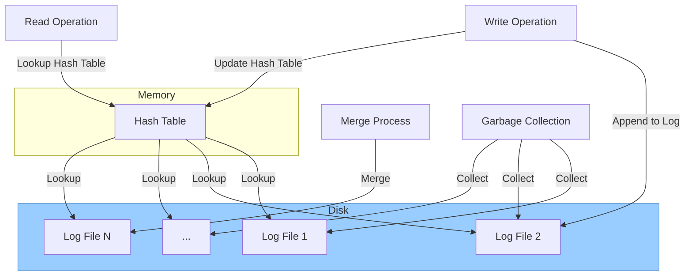

# BitCask 简介

BitCask 是一种 KV 存储引擎的结构，存储引擎故名思义是用来存放数据的。KV 是指 Key Value 

在内存中用哈希表来存储组织数据，在磁盘上使用追加的方式写入数据。

## BitCask 架构

当读取数据时，根据 key 直接从哈希表中获取相应的 value 。

当写入数据时，将 key 和 value 打包以追加的方式写入日志文件中，与此同时还要将 kv 插入哈希表中。

当更新数据时，

