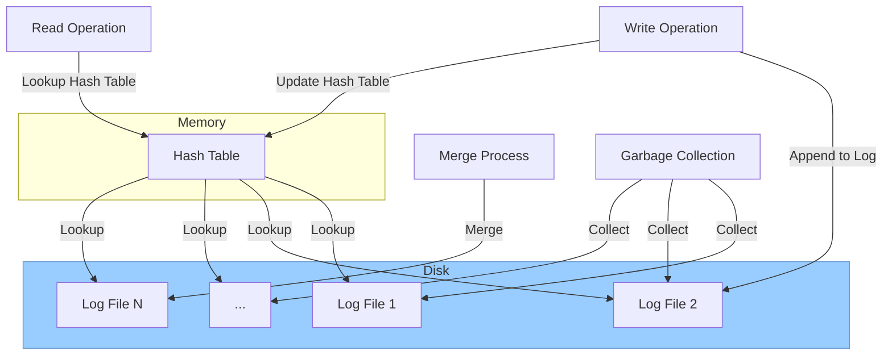

# Bitcask 简介

Bitcask 是一种简单的存储引擎，存储引擎是数据库的核心组件，负责存储和管理数据，即数据在内存，磁盘上是如何组织的，设计一个合理的存储引擎是为了实现高效的存取数据。

存储引擎以插件的形式存在，每个数据库可以支持多个存储引擎，不同的存储引擎具有不同的特性和性能，适用于不同的应用场景。例如，InnoDB 存储引擎支持事务处理，适用于在线事务处理（OLTP）应用；MyISAM 存储引擎不支持事务处理，但具有较高的性能，适用于数据库备份和报表等应用。

## Bitcask 发展历史

Bitcask 的起源和发展历史可以简要地概述如下：

1. **起源**：Bitcask 最初是由 Basho Technologies 为其开发的分布式数据库 Riak 设计的。这是一个 Erlang 应用程序，目的是提供一种高效的方式来存储和检索键/值对数据。

2. **设计灵感**：Bitcask 的设计部分受到了日志结构化文件系统和日志文件合并技术的启发。它的主要特点是使用日志结构化哈希表，为键/值对存储提供快速访问。

3. **发展**：Bitcask 随着 Riak 的普及而逐渐发展。它因其高性能写入和有效的读取性能而受到关注，特别适用于写入密集型的应用场景。

4. **相关产品**：虽然 Bitcask 最初是为 Riak 设计的，但它的应用并不局限于此。由于其开源性质和高效的性能特点，Bitcask 也被用于其他项目和应用中，尤其是在需要高速数据写入和检索的场景。

总的来说，Bitcask 以其高效的数据写入和检索能力，在分布式数据库和存储系统领域占有一席之地，特别是在需要处理大量写入操作的应用中表现出色。

[bitcask-intro](https://riak.com/assets/bitcask-intro.pdf) 是对应的论文，可以进一步阅读。

## Bitcask 原理

Bitcask **在内存中**用一张哈希表来组织 Key 和 Value ，**在磁盘上**则是直接将数据追加到文件末尾。

1. **日志结构化存储**：Bitcask 所有的写入操作都是追加到文件末尾，而不是在文件中的特定位置，从而大大提高了写入性能。

2. **键/值对访问**：在 Bitcask 中，数据以键/值对的形式存储。

3. **快速键查找**：Bitcask 维护了一个内存中的哈希表，用于快速定位键对应的数据在文件中的位置，从而实现快速的数据检索。

4. **文件合并**：随着时间的推移，日志文件会变得越来越大。Bitcask 通过定期合并这些文件来优化存储空间的使用，同时去除过期或被删除的数据。

5. **高效恢复机制**：在系统崩溃或其他故障情况下，Bitcask 能够通过其日志文件快速恢复数据。

简而言之，Bitcask 通过其日志结构化存储、快速键查找和高效的文件合并机制，提供了一种高效的方式来处理大量的写入操作，同时保持了良好的读取性能。

## Bitcask 在内存中

Bitcask 使用哈希索引来快速查找数据。哈希索引将键映射到段和位置。

当需要查找数据时，会先在哈希索引中查找键。如果找到了键，则可以根据索引信息直接定位到段和位置。


Bitcask 存储引擎的架构可以分为以下几个部分：

* **数据存储**：Bitcask 存储引擎使用固定大小的文件存储数据，每个文件称为一个段（segment）。段的大小可以根据实际需要进行调整。
* **数据索引**：Bitcask 存储引擎使用哈希索引来快速查找数据。哈希索引将键映射到段和位置。
* **数据操作**：Bitcask 存储引擎支持插入、删除和更新等数据操作。

**数据存储**

Bitcask 存储引擎使用固定大小的文件存储数据，每个文件称为一个段（segment）。段的大小可以根据实际需要进行调整。

数据写入 Bitcask 存储引擎时，首先会将数据写入一个日志文件中。日志文件是一个追加写文件，因此可以保证数据的顺序性。

当日志文件达到一定大小时，会被切分为一个段。段会被追加到一个段列表中。


**数据操作**

Bitcask 存储引擎支持插入、删除和更新等数据操作。

插入操作：将数据写入日志文件。

删除操作：将数据从段中删除，并更新哈希索引。

更新操作：将数据从段中删除，然后插入新的数据。

**Bitcask 的优势**

Bitcask 具有以下优势：

* 高性能：Bitcask 采用了简单的设计，因此具有较高的性能。
* 高可靠性：Bitcask 使用了多种技术来保证数据的可靠性，包括日志记录、数据复制和数据校验。
* 低成本：Bitcask 使用了固定大小的文件存储数据，因此成本较低。

**Bitcask 的劣势**

Bitcask 具有以下劣势：

* 不支持事务处理：Bitcask 不支持事务处理。
* 不支持复杂查询：Bitcask 只支持简单的查询，不支持复杂查询。

## 写操作流程

在 Bitcask 中，写操作涉及到以下几个步骤：

1. **将数据写入日志文件**

数据写入 Bitcask 时，首先会将数据写入一个日志文件中。日志文件是一个追加写文件，因此可以保证数据的顺序性。

日志文件的格式如下：

```
<键> <值> <时间戳>
```

其中，键是数据的键，值是数据的值，时间戳是数据写入的时间戳。

2. **将日志文件切分为段**

当日志文件达到一定大小时，会被切分为一个段。段的大小可以根据实际需要进行调整。

段的格式如下：

```
<键> <值> <时间戳>
```

3. **将段追加到段列表中**

段会被追加到一个段列表中。段列表用于记录所有已创建的段。

4. **更新哈希索引**

哈希索引将键映射到段和位置。在将数据写入段后，需要更新哈希索引，以便快速查找数据。

更新哈希索引的步骤如下：

```
1. 计算键的哈希值。
2. 查找哈希索引，找到对应的段和位置。
3. 如果段和位置不存在，则将段和位置添加到哈希索引中。
4. 如果段和位置存在，则更新哈希索引中的值。
```

需要注意的是，Bitcask 不支持事务处理。如果写操作失败，则数据可能丢失。

当读取数据时，根据 key 直接从哈希表中获取相应的 value 。

当写入数据时，将 key 和 value 打包以追加的方式写入日志文件中，与此同时还要将 kv 插入哈希表中。

## 读操作流程

Bitcask 读操作涉及到以下几个步骤：

1. **在哈希索引中查找键**

读操作首先会在哈希索引中查找键。如果找到了键，则可以根据索引信息直接定位到段和位置。

2. **读取数据**

根据索引信息，读取数据所在的段和位置。

3. **返回数据**

将数据返回给客户端。
当更新数据时，


## API 设计


Bitcask 的 API 非常简单，只有以下几种操作：

* **打开数据库**：`bitcask:open(DirectoryName)` 用于打开一个新的或现有的数据库。如果指定了 `read write` 选项，则表示该进程可以进行写操作。如果指定了 `sync on put` 选项，则表示每次写操作后会将数据同步到磁盘。
* **读取数据**：`bitcask:get(BitcaskHandle, Key)` 用于读取数据库中指定键的数据。如果数据存在，则返回 `{ok, Value}`；如果数据不存在，则返回 `not found`。
* **写入数据**：`bitcask:put(BitcaskHandle, Key, Value)` 用于写入数据库中指定键的数据。如果写入成功，则返回 `ok`；如果写入失败，则返回错误信息。
* **删除数据**：`bitcask:delete(BitcaskHandle, Key)` 用于删除数据库中指定键的数据。如果删除成功，则返回 `ok`；如果删除失败，则返回错误信息。
* **列出所有键**：`bitcask:list keys(BitcaskHandle)` 用于列出数据库中的所有键。
* **遍历数据库**：`bitcask:fold(BitcaskHandle,Fun,Acc0)` 用于遍历数据库中的所有键值对。`Fun` 是一个函数，用于处理每个键值对。`Acc0` 是初始状态。
* **合并数据库**：`bitcask:merge(DirectoryName)` 用于合并数据库中的多个数据文件。
* **强制同步数据**：`bitcask:sync(BitcaskHandle)` 用于强制将数据同步到磁盘。
* **关闭数据库**：`bitcask:close(BitcaskHandle)` 用于关闭数据库。

总体而言，Bitcask 的 API 非常简单易用。




