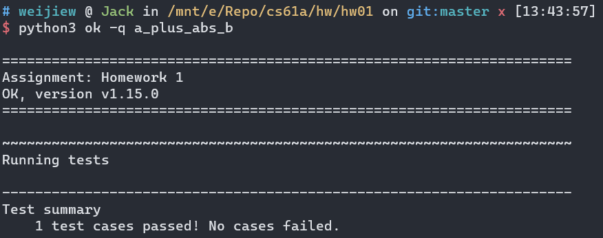
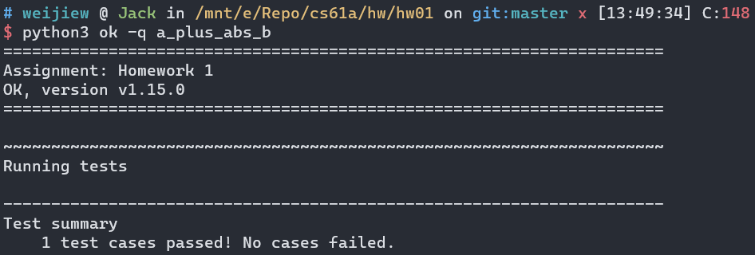

# HW 01

## Q1: Syllabus Quiz

了解教学大纲（略）

## Q2: A Plus Abs B

> 注意原有代码不能修改，也就是只能在代码的基础上添加内容。

```python
def a_plus_abs_b(a, b):
    if b >= 0:
        h = add
    else:
        h = sub
    return h(a, b)
```



## Q3: Two of Three

只能写一行代码 `x**2 + y**2 + z**2 - max(x, y, z)**2`。

另一种思路：`min(x, y)**2 + min(y, z)**2 + min(x, z)**2 - min(x, y, z)**2` 其实枚举一下就行。



## Q4: Largest Factor

这道题的意思是给定一个数字 n ，在 [1,n-1] 中寻找到能整除的最大数字。

直接暴力遍历一遍就行🤣。

```python
def largest_factor(x):
    k = x - 1
    while k >= 1:
        if x % k == 0:
            return k
        k -= 1
```

## Q5: If Function vs Statement

写这道题的时候我很困惑，不知道这道题想考什么。其实这道题很简单，题目是函数和语句的区别。

实际上这道题的重点是，如果表达式复合 if 条件，就执行 if 语句中的代码。那么 else 中的代码不会执行。

但是对于函数而言，`if_function(c(), t(), f())` 会将所有参数的结果（`c(),t(),f()`）都执行完毕后才会执行 `if_function()` 。

所以执行`if_function(c(), t(), f())`会输出 5，6 并且因为没有返回值，所以还会输出 None 。

本质问题就是函数在调用参数会计算参数值。

```python
def c():
    return False

def t():
    print(5)

def f():
    print(6)
```

## Q6: Hailstone

```python
def hailstone(x):
    length = 1
    while x != 1:
        print(x)
        if x % 2 == 0:
            x //=  2    
        else:
            x = 3 * x + 1
        length = length + 1
    print(x)            
    return length
```